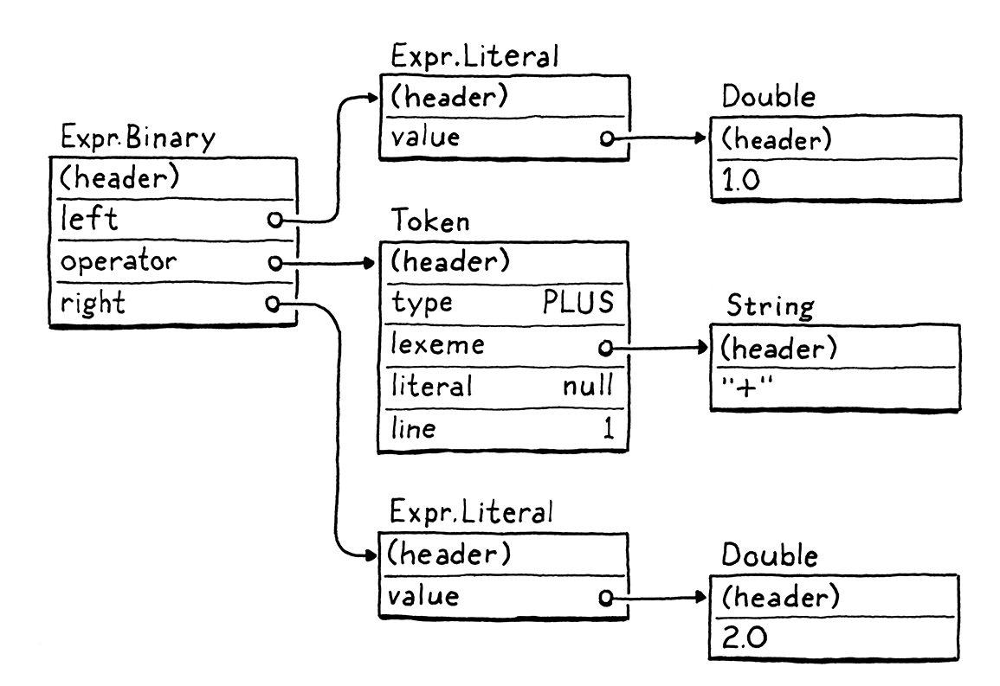
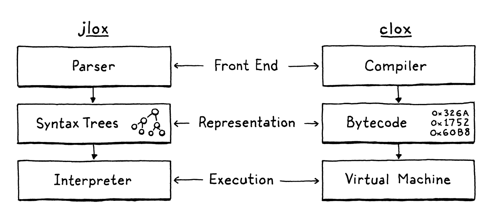
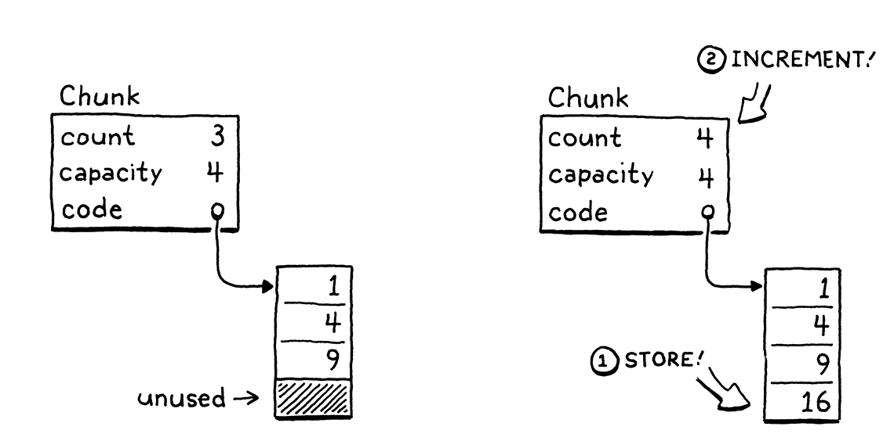
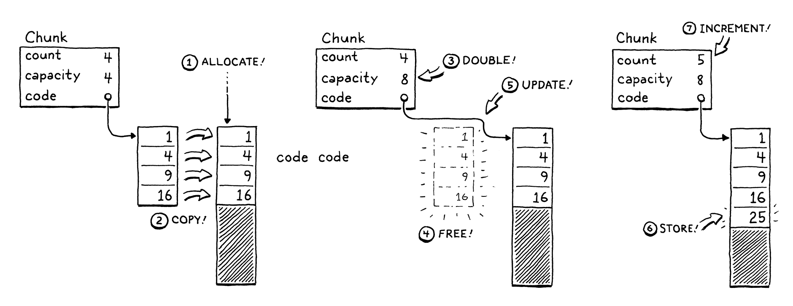
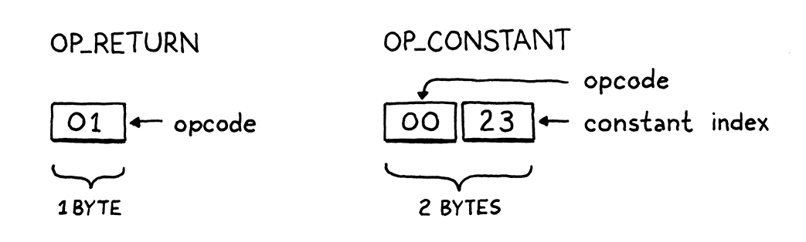

# Chunks of Bytecode

> If you find that you're spending almost all your time on theory, start turning some attention to practical things; it
> will improve your theories. If you find that you're spending almost all your time on practice, start turning some
> attention to theoretical things; it will improve your practice.
> - Donald Knuth

The jlox relies on the JVM to do lots of things for us. If we want to understand how an interpreter works all the way 
down to the metal, we need to build those bits and pieces ourselves.

An even more fundamental reason that jlox isn't sufficient is that it's too damn slow. A tree-walk interpreter is fine 
for some kinds of high-level, declarative languages. But for general-purpose, imperative language - even a "scripting"
language like Lox - it won't fly.
E.g.:
```shell
fun fib(n) {
  if (n < 2 ) return n;
  return fib(n - 1) + fib(n - 2);
}

var before = clock();
print fib(40);
var after = clock();
print after - before;
```
This takes jlox about 54 seconds to execute. An equivalent C program finishes in half a second. Our dynamically typed
scripting language is never going to be as fast as a statically typed language with manual memory management, but we 
don't need to settle for more than *two orders of magnitude* slower.

We could take jlox and run it in a profiler and start tuning and tweaking hotspots, but that will only get us so far.
The execution model - walking the AST - is fundamentally the wrong design. We can't micro-optimize that to the 
performance we want any more that you can polish an AMC Gremlin into an SR-71 Blackbird.

## Bytecode?

**In engineering, few choices are without trade-offs.** To best understand why we're going with bytecode, let's stack it
up against a couple of alternatives.

### *Why not walk the AST?*

Our existing interpreter has a couple of things going for it:
* Well, first, we already wrote it. It's done. And the main reason it's done is that this style of interpreter is
    *really simple to implement*. The runtime representation of the code directly maps to the syntax. It's virtually
    effortless to get from the parser to the data structures we need at runtime.
* It's *portable*. Our current interpreter is written in Java and runs on any platform Java supports. We could write a 
    new implementation in C using the same approach and compile and run our language on basically every platform under 
    the sun.

Those are real advantages. But, on the other hand, it's *not memory-efficient*. Each piece of syntax becomes an AST 
node. A tiny Lox expression like `1 + 2` turns into a slew of objects with lots of pointers between them, something 
like:

> The "(header)" parts are the bookkeeping information the Java virtual machine uses to support memory management and 
> store the object's type. Those take up space too!

Each of those pointers adds an extra 32 or 64 bits of overhead to the object. Worse, sprinkling our data across the heap
in a loosely connected web of objects does bad things for *spatial locality*.

Modern CPUs process data way faster than they call pull it from RAM. To compensate for that, chips have multiple layers
of caching. If a piece of memory it needs is already in the cache, it can be loaded more quickly.

How does data get into the memory? The machine speculatively stuffs things in there for you. Its heuristic is pretty 
simple. Whenever the CPU reads a bit of data from RAM, it pulls in a whole little bundle of adjacent bytes and stuffs
them in the cache.

If our program next requests some data close enough to be inside that cache line, our CPU runs like a well-oiled 
conveyor belt in a factory. We *really* want to take advantage of this. To use the cache effectively, the way we 
represent code in memory should be dense and ordered like it's read.

Now look up at that tree. Those sub-objects could be *anywhere*. Every step the tree-walker takes where it follows a 
reference to a child node may step outside the bounds of the cache and force the CPU to stall until a new lump of data
can be slurped in from RAM. Just the *overhead* of those tree nodes with all of their pointer fields and object headers
tends to push objects away from each other and out of the cache.

Our AST walker has other overhead too around interface dispatch and the Visitor pattern, but the locality issues alone 
are enough to justify a better code representation.

### *Why not compile to native code?*

If you want to go *read* fast, you want to get all of those layers of indirection out of the way. Right down to the 
metal. Machine code. It even *sounds* fast. *Machine code*.

Compiling directly to the native instruction set the chip supports is what the fastest languages do. Targeting native 
code has been the most efficient option since way back in the early days when engineers actually handwrote programs in
machine code.

Native code is a dense series of operations, encoded directly in binary. Each instruction is between one and a few bytes
long, and is almost mind-numbingly low level. "Move a value from this address to this register." "Add the integers in
these two registers." Stuff like that.

The CPU cranks through the instructions, decoding and executing each one in order. There is no tree structure like our 
AST, and control flow is handled by jumping from one point in the code directly to another. No indirection, no overhead,
no unnecessary skipping around or chasing pointers.

Lightning fast, but that performance comes at a cost. First of all, compiling to native code ain't easy. 
<span style="color:red">Most chips in wide use today have sprawling Byzantine architectures with heaps of instructions 
that accreted over decades. They require sophisticated register allocation, pipelining, and instruction scheduling.
</span>

And, of course, you've thrown portability out. Spend a few years mastering some architecture and that still only gets 
you onto *one* of the several popular instruction sets out there. To get your language on all of them, you need to learn
all of their instruction sets and write a separate back end for each one.

### *What is bytecode?*

Fix those two points in your mind. On one end, a tree-walk interpreter is simple, portable, and slow. On the other, 
native code is complex and platform-specific but fast. Bytecode sits in the middle. It retains the portability of a
tree-walker. It sacrifices *some* simplicity to get a performance boost in return, though not as fast as going fully 
native.

Structurally, bytecode resembles machine code. It's a dense, linear sequence of binary instructions. That keeps overhead
low and plays nice with the cache. However, it's a much simpler, higher-level instruction set than any real chip out
there. (In many bytecode formats, each instruction is only a single byte long, hence "bytecode").

Imagine you're writing a native compiler from some source language, and you're given carte blanche to define the easiest
possible architecture to target. Bytecode is kind of like that. It's an idealized fantasy instruction set that makes 
your life as the compiler writer easier.

The problem with a fantasy architecture, or course, is that it doesn't exist. We solve that by writing an *emulator* - a
simulated chip written in software that interprets the bytecode one instruction at a time. A *virtual machine (VM)*, if 
you will.

That emulation layer adds overhead, which is a key reason bytecode is slower that native code. But in return, it gives 
us portability. Write our VM in a language like C that is already supported on all the machines we care about, and we 
can run our emulator on top of any hardware we like.

> One of the first bytecode formats was [p-code](https://en.wikipedia.org/wiki/P-code_machine), developed for Niklaus
> Wirth's Pascal language. You might think a PDP-11 running at 15MHz couldn't afford the overhead of emulating a virtual
> machine. But back then, computers were in their Cambrian explosion and new architectures appeared every day. Keeping
> up with the latest chips was worth more than squeezing the maximum performance from each one. That's why the "p" in 
> p-code doesn't stand for "Pascal", but "portable".

This is the path we'll take with our new interpreter, clox. We'll follow in the footsteps of the main implementations of
Python, Ruby, Lua, OCaml, Erlang, and others. In many ways, our VM's design will parallel the structure of our previous
interpreter:

Of course, we won't implement the phases strictly in order. Like our previous interpreter, we'll bounce around, building
up the implementation one language feature at a time. In this chapter, we'll get the skeleton of the application in 
place and create the data structures needed to store and represent a chunk of bytecode.

## Getting Started

Dynamic Arrays provide:
* Cache-friendly, dense storage
* Constant-time indexed element lookup
* Constant-time appending to the end of the array

In Dynamic Arrays, when we add an element, if the count is less than the capacity, then there is already available space
in the array. We store the new element right in there and bump the count.

If we have no spare capacity, then the process is a little more involved.

1. Allocate a new array with more capacity.
2. Copy the existing elements from the old array to the new one.
3. Store the new `capacity`.
4. Delete the old array
5. Update `code` to point to the new array
6. Store the element in the new array now that there is room
7. Update the `count`

> Copying the existing elements when you grow the array makes it seem like appending an element is O(n), not O(1) like 
> mentioned above. However, you need to do this copy step only on *some* of the appends. Most of the time, there is 
> already extra capacity, so you don't need to copy.
> 
> To understand how this works, we need [amortized analysis](https://en.wikipedia.org/wiki/Amortized_analysis). That 
> shows us that as long as we grow the array by a multiple of its current size, when we average out the cost of a 
> *sequence* of appends, each append if O(1).

### *A dynamic array instructions*

The interesting cases are when both `oldSize` and `newSize` are not zero. Those tell `realloc()` to resize the 
previously allocated block. If the new size is smaller than the existing block of memory, it simply updates the size of
the block and returns the same pointer you gave it. If the new size is larger, it attempts to grow the existing block of
memory.

> Since all we passed in was a bare pointer to the first byte of memory, what does it mean to "update" the block's size?
> Under the hood, the memory allocator maintains additional bookkeeping information for each block of heap-allocated
> memory, including its size.
> 
> Given a pointer to some previously allocated memory, it can find this bookkeeping information, which is necessary to
> be able to cleanly free it. It's this size metadata that `realloc()` updates.
> 
> Many implementations of `malloc()` store the allocated size in memory right *before* the returned address.

It can do that only if the memory after that block isn't already in use. If there isn't room to grow the block, 
`realloc()` instead allocates a *new* block of memory of the desired size, copies over the old bytes, frees the old 
block, and then returns a pointer to the new block.

## Constants

Now that we have a rudimentary chunk structure working, let's start making it more useful. We can store *code* in 
chunks, but what about *data*? Many values the interpreter works with are created at runtime as the result of 
operations.
```shell
1 + 2;
```
The value 3 appears nowhere in the code here. However, the literals `1` and `2` do. To compile that statement to 
bytecode, we need some sort of instruction that means "produce a constant" and those literal values need some sort of
instruction that means "produce a constant" and those literal values need to get stored in the chunk somewhere. In jlox,
the Expr.Literal AST node held the value. We need a different solution now that we don't have a syntax tree.

### *Representing values*

Back to the question of where to store constants in a chunk. For small fixed-size values like integers, many instruction
sets store the value directly in the code stream right after the opcode. These are called **immediate instructions**
because the bits for the value are immediately after the opcode.

That doesn't work well for large or variable-sized constants like strings. In a native compiler to machine code, those
bigger constants get stored in a separate "constant data" region in the binary executable. Then, the instruction to load
a constant has an address or offset pointing to where the value is stored in that section.

Most virtual machines do something similar. E.g., the Java Virtual Machine 
[associates a **constant pool**](https://docs.oracle.com/javase/specs/jvms/se7/html/jvms-4.html#jvms-4.4) with each
compiled class. That sounds good enough for clox to me. Each chunk will carry with it a list of the values that appear
as literals in the program. To keep things simper, we'll put *all* constants in there, even simple integers.

> In addition to needing two kinds of constant instructions - one for immediate values and one for constants in the
> constant table - immediates also force us to worry about alignment, padding, and endianness. Some architectures 
> aren't happy if you try to say, stuff a 4-byte integer at an odd address.

### *Value arrays*

The constant pool is an array of values. The instruction to load a constant looks up the value by index in that array.
As with our bytecode array, the compiler doesn't know how big the array needs to be ahead of time. So, again, we need a
dynamic one. Since C doesn't have generic data structures, we'll write another dynamic array data structure, this time
for Value.

### *Constant instructions*

We can *store* constants in chunks, but we also need to *execute* them. In a piece of code like:
```shell
print 1;
print 2;
```
The compiled chunk needs to not only contain the values 1 and 2, but know *when* to produce them so that they are 
printed in the right order. Thus, we need an instruction that produces a particular constant.

When the VM executes a constant instruction, it "loads" the constant for use. This new instruction is a little more 
complex than `OP_RETURN`. In the above example, we load two different constants. A single bare opcode isn't enough to 
know *which* constant to load.

> The means to "load" or "produce" a constant is vague because we haven't learned how the VM actually executes code at
> runtime yet.

To handle cases like this, our bytecode - like most others - allows instructions to have **operands**. These are stored 
as binary data immediately after the opcode in the instruction stream and let us parameterize what the instruction does.


> Bytecode instruction operands are *not* the same as the operands passed to an arithmetic operator. Instruction 
> operands are a lower-level notion that modify how the bytecode instruction itself behaves.

Each opcode determines how many operand bytes it has and what they mean. E.g., a simple operation like "return" may have
no operands, where an instruction for "load local variable" needs an operand to identify which variable to load. Each 
time we add a new opcode to clox, we specify what its operands look like - its **instruction format**.

## Line Information

Chunks contain almost all the information that the runtime needs from the user's source code. It's kind of crazy to 
think that we can reduce all the different AST classes that we created in jlox down to an array of bytes and an array of
constants. There's only one piece of data we're missing. We need it, even though the user hopes to never see it.

When the runtime error occurs, we show the user the line number of the offending source code. In jlox, those numbers
live in tokens, which we in turn store in the AST nodes. We need a different solution for clox now that we've ditched 
syntax trees in favor of bytecode. Given any bytecode instruction, we need to be able to determine the line of the 
user's source program that it was compiled from.

There are a lot of clever ways we could encode this. I took the absolute simplest approach I could come up with, even 
though it's embarrassingly inefficient with memory. In the chunk, we store a separate array of integers that parallels 
the bytecode. Each number in the array is the line number for the corresponding byte in the bytecode. When a runtime 
error occurs, we look up the line number at the same index as the current instruction's offset in the code array.