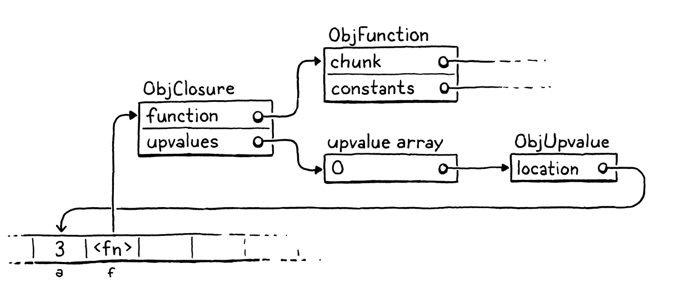

# Closure

```shell
var x = "global";
fun outer() {
  var x = "outer";
  fun inner() {
    print x;
  }
  inner();
}
outer();
```
The function ought to print `"outer"`, but the result is `"global"`. To fix this we need to include the entire lexical 
scope of all surrounding functions when resolving a variable.

The problem is harder in clox than it was in jlox 'cause our bytecode VM stores locals on a stack. We used a stack 
'cause locals have stack semantics - variables are discarded in the reverse order that they are created. But with 
closure, that's only *mostly* true.
```shell
fun makeClosure() {
  var local = "local";
  fun closure() {
    print local;
  }
  return closure;
}

var closure = makeClosure();
closure();
```
The outer function `makeClosure()` declares a variable, `local`. It also creates an inner function, `closure()` that 
captures that variable. Then `makeClosure()` returns a reference to that function. Since the closure escapes while 
holding on to the local variable, `local` must outlive the function call where it was created.

We could solve this problem by dynamically allocating memory for all local variables. That's what jlox does by putting 
everything in those Environment objects that float around in Java's heap. But we don't want to. Using a stack is 
*really* fast. Most local variables are *not* captured by closures and do have stack semantics. It would suck to make 
all those slower for the benefit of the rare local that is captured.

> There is a reason that C and Java use the stack for local variables, after all.

This means a more complex approach than we used in our Java interpreter. 'cause some locals have very different 
lifetimes, we'll have two implementation strategies. For locals that aren't used in closures, we'll keep them in just 
as they are on the stack. When a local is captured by a closure, we'll adopt another solution that lifts them onto the 
heap where they can live as long as needed.

Closures have been around since the early Lisp days when bytes of memory and CPU cycles were more precious than emeralds.
Over the intervening decades, hackers devised all manners of ways to compile closures to optimize runtime 
representations. Some are more efficient but require a more complex compilation process than we could easily retrofit
into clox.

The technique I explain here comes from the design of the Lua VM. It is fast, parsimonious with memory, and implemented
with relatively little code. Even more impressive, it fits naturally into the single-pass compilers clox and Lua both 
use. It is somewhat intricate, though. It might take a while before all the pieces click together in your mind. We'll
build them one step at a time, and I'll try to introduce the concepts in stages.

## Closure Objects

Our VM represents functions at runtime using ObjFunction. These objects are created by the front end during compilation.
At runtime, all the VM does is load the function object from a constant table and bind it to a name. There is no 
operation to "create" a function at runtime. Much like string and number literals, they are constants instantiated 
purely at compile time.

> In other words, a function declaration is Lox is a kind of literal - a piece of syntax that defines a constant value 
> of a built-in type.

That made sense 'cause all the data that composes a function is known at compile time: the chunk of bytecode compiled 
from the function's body, and the constants used in the body. Once we introduce closures, though, that representation is
no longer sufficient. Take a gander at:
```shell
fun makeClosure(value) {
  fun closure() {
    print value;
  }
  return closure;
}

var doughnut = makeClosure("doughnut");
var bagel = makeClosure("bagel");
doughnut();
bagel();
```
The `makeClosure()` function defines and returns a function. We call it twice and get two closures back. They are 
created by the same nested function declaration, `closure`, but close over different values. When we call the two 
closures, each prints a different string. That implies we need some runtime representation for a closure that captures
the local variables surrounding the function as they exist when the function declaration is *executed*, not just when it
is compiled.

## Upvalues

Our existing instructions for reading and writing local variables are limited to a single function's stack window. 
Locals from a surrounding function are outside of the inner function's stack window. We're going to need some new 
instructions.

The easiest approach might be an instruction that takes a relative stack slot offset that can reach *before* the current
function's window. That would work if closed-over variables were always on the stack. But as we saw earlier, these
variables sometimes outlive the function where they are declared. That means they won't always be on the stack.

The next easiest approach, then, would be to take any local variable that gets closed over and have it always live on 
the heap. When the local variable declaration in the surrounding function is executed, the VM would allocate memory for
it dynamically. That way it could live as long as needed.

This would be a fine approach if clox didn't have a single-pass compiler. But that restriction we chose in our 
implementation makes things harder. Take a look at this e.g.:
```shell
fun outer() {
  var x = 1;     // (1)
  x = 2;         // (2)
  fun inner() {  // (3)
    print x;
  }
  inner();
}
```
Here, the compiler compiles the declaration of `x` at `(1)` and emits code for the assignment at `(2)`. It does that 
before reaching the declaration of `inner()` at `(3)` and discovering that `x` is in fact closed over. We don't have an
easy way to go back and fix that already-emitted code to treat `x` specially. Instead, we want a solution that allows a
closed-over variable to live on the stack exactly like a normal local variable *until the point that it is closed over*.

Fortunately, thanks to the Lua dev team, we have a solution. We use a level of indirection that they call an **upvalue**
. An upvalue refers to a local variable in an enclosing function. Every closure maintains an array of upvotes, one for 
each surrounding local variable that the closure uses.

The upvalue points back into the stack to where the variable it captured lives. When the closure needs to access a 
closed-over variable, it goes through the corresponding upvalue to reach it. When a function declaration is first 
executed and we create a closure for it, the VM creates the array of upvalues and wires them up to "capture" the 
surrounding local variables that the closure needs.

E.g., if we throw this program at clox
```shell
{
  var a = 3;
  fun f() {
    print a;
  }
}
```
the compiler and runtime will conspire together to build up a set of objects in memory like this:



That might look overwhelming, but fear not. We'll work out way through it. The important part is that upvalues serve as
the layer of indirection needed to continue to find a captured local variable even after it moves off the stack. But
before we get to all that, let's focus on compiling captured variables.