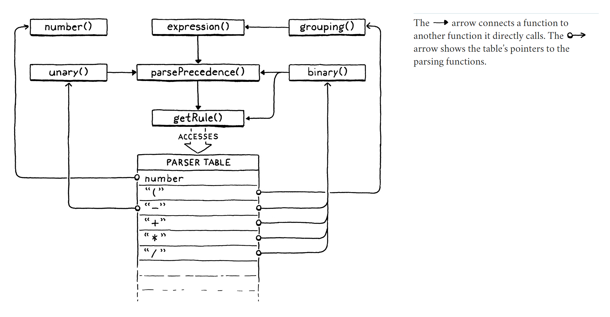

# Compiling Expressions

> In the middle of the journey of our life I found myself within a dark woods where the straight way was lost.
> - Dante Alighieri, *Inferno*

This chapter:
1. provides the final segment of our VM's execution pipeline. Once in place, we can plumb the user's source code from 
    scanning all the way through to executing it.

2. we get to write an actual, honest-to-God *compiler*. It parses source code and outputs a low-level series of binary 
    instructions. Sure, it's bytecode and not some chip's native instruction set, but it's way closer to the metal than
    jlox was. We're about to be real language hackers.
3. finally, Vaughan Pratt's "top-down operator precedence parsing". It's the most elegant way I know to parse 
    expressions. It gracefully handles prefix operators, postfix, infix, *mixfix*, any kind of *-fix* you got. It deals 
    with precedence and associativity without breaking a sweat.

> Pratt parsers are a sort of oral tradition in industry. No compiler or language book I've read teaches them. Academia
> is very focused on generated parsers, and Pratt's technique is for handwritten ones, so it gets overlooked.
> 
> But in production compilers, where hand-rolled parsers are common, you'd be surprised how many people know it. Ask 
> where they learned it, and it's always, "Oh, I worked on this computer years ago and my coworker said they took it 
> from this old front end..."

## Single-Pass Compilation

A compiler has roughly two jobs. It parses the user's source code to understand what it means. Then it takes that 
knowledge and outputs low-level instructions that produce the same semantics. Many languages split those two roles into 
two separate passes in the implementation. A parser produces an AST - just like jlox does - and then a code generator 
traverses the AST and outputs target code. 

In clox, we're taking an old-school approach and merging these two passes into one. Back in the day, language hackers 
did this because computers literally didn't have enough memory to store an entire source file's AST. We're doing it 
because it keeps our compiler simpler, which is a real asset when programming in C.

> In fact, most sophisticated optimizing compilers have a heck of a lot more than two passes. Determining not just 
> *what* optimization passes to have, but how to order them to squeeze the most performance out of the compiler - since
> the optimizations often interact in complex ways - is somewhere between an "open area of research" and a "dark art".

Single-pass compilers like we're going to build don't work well for all languages. Since the compiler has only a 
peephole view into the user's program while generating code, the language must be designed such that you don't need much
surrounding context to understand a piece of syntax. Fortunately, tiny, dynamically typed Lox is well-suited to that.

What this means in practical terms is that our "compiler" C module has functionality you'll recognize from jlox for 
parsing - consuming tokens, matching expected token types, etc. And it also has functions for code gen - emitting 
bytecode and adding constants to the destination chunk. (And it means I'll use "parsing" and "compiling" interchangeably
throughout this and later chapters.)

We'll build the parsing and code generation halves first. Then we'll stitch them together with the code in the middle 
that uses Pratt's technique to parse Lox's particular grammar and output the right bytecode.

## Parsing Tokes

## Parsing Prefix Expressions

We've assembled our parsing and code generation utility functions. The missing piece is the code in the middle that 
connects those together.

## A Pratt Parser

If you really want to mind meld with Vaughan Pratt and fully understand the algorithm, step through the parser in the 
debugger as it works through some expressions. Maybe a picture will help. There's only a handful of functions, but they 
are marvelously interwined.

Later, we'll need to tweak the code in this chapter to handle assignment. But, otherwise, what we wrote covers all our 
expression compiling needs for the rest of the book. We'll plug additional parsing functions into the table when we add 
new kinds of expressions, but `parsePrecedence()` is complete.

## Dumping Chunks

While we're here in the core of our compiler, we should put in some instrumentation. To help debug the generated 
bytecode, we'll add support for dumping the chunk once the compiler finishes. We had some temporary logging earlier when
we hand-authored the chunk. Now we'll put in some real code so that we can enable it whenever we want.

# Note: IT'S JUST PARSING

Bob's claim is that *parsing doesn't matter*.

Over the years, many programming language people, especially in academia, have gotten *really* into parsers and taken 
them very seriously. Initially, it was the compiler folks who got into compiler-compilers, LALR, and other stuff like 
that. The first half of the dragon book is a long love letter to the wonders of parser generators.

> All of us suffer from the vice of "when all you have is a hammer, everything looks like a nail", but perhaps none so 
> visibly as compiler people. You wouldn't believe the breadth of software problems that miraculously seem to require a 
> new little language in their solution as soon as you ask a compiler hacker for help.
> 
> Yacc and other compiler-compilers are the most delightfully recursive e.g. "Wow, writing compilers is a chore. I know,
> let's write a compiler to write our compiler for us."
> 

Later, the functional programming folks got into parser combinators, packrat parsers, and other sorts of things. 
Because, obviously, if you give a functional programmer a problem, the first thing they'll do is whip out a pocketful of
higher-order functions.

Over in math and algorithm analysis land, there is a long legacy of research into proving time and memory usage for 
various parsing techniques, transforming parsing problems into other problems and back, and assigning complexity classes
to different grammars.

At one level, this stuff is important. If you're implementing a language, you want some assurance that your parser won't
go exponential and take 7,000 years to parse a weird edge case in the grammar. Parser theory gives you that bound. As an
intellectual exercise, learning about parsing techniques is also fun and rewarding.

But if your goal is just to implement a language and get it in front of users, almost all that stuff doesn't matter. 
It's really easy to get worked up by the enthusiasm of the people who *are* into it and think that your front end 
*needs* some whiz-bang generated combinator-parser-factory thing. I've seen people burn tons of time writing and 
rewriting their parser using whatever today's hot library or technique is.

That's time that doesn't add any value to your user's life. If you're just trying to get your parser done, pick one of 
the bog-standard techniques, use it, and move on. Recursive descent, Pratt parsing, and the popular parser generator 
like ANTLR or Bison are all fine.

Take the extra time you saved not rewriting your parsing code and spend it improving the compile error messages your 
compiler shows users. Good error handling and reporting is more valuable to users than almost everything else you can 
put time into in the front end.