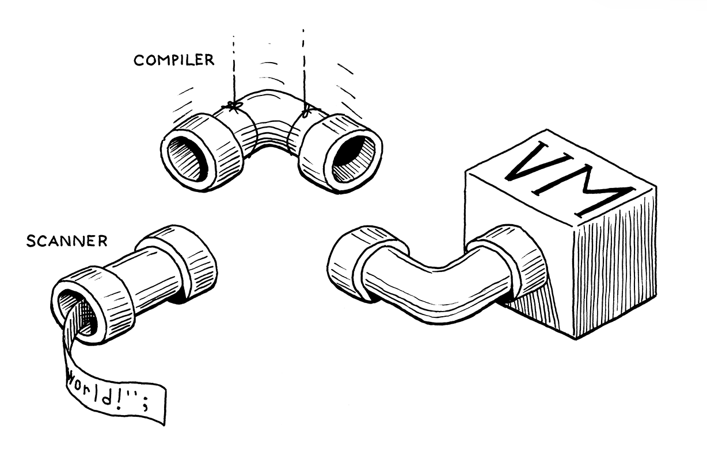
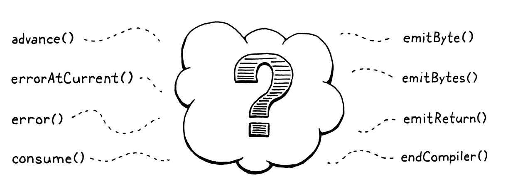

# Compiling Expressions

> In the middle of the journey of our life I found myself within a dark woods where the straight way was lost.
> - Dante Alighieri, *Inferno*

This chapter:
1. provides the final segment of our VM's execution pipeline. Once in place, we can plumb the user's source code from 
    scanning all the way through to executing it.

2. we get to write an actual, honest-to-God *compiler*. It parses source code and outputs a low-level series of binary 
    instructions. Sure, it's bytecode and not some chip's native instruction set, but it's way closer to the metal than
    jlox was. We're about to be real language hackers.
3. finally, Vaughan Pratt's "top-down operator precedence parsing". It's the most elegant way I know to parse 
    expressions. It gracefully handles prefix operators, postfix, infix, *mixfix*, any kind of *-fix* you got. It deals 
    with precedence and associativity without breaking a sweat.

> Pratt parsers are a sort of oral tradition in industry. No compiler or language book I've read teaches them. Academia
> is very focused on generated parsers, and Pratt's technique is for handwritten ones, so it gets overlooked.
> 
> But in production compilers, where hand-rolled parsers are common, you'd be surprised how many people know it. Ask 
> where they learned it, and it's always, "Oh, I worked on this computer years ago and my coworker said they took it 
> from this old front end..."

## Single-Pass Compilation

A compiler has roughly two jobs. It parses the user's source code to understand what it means. Then it takes that 
knowledge and outputs low-level instructions that produce the same semantics. Many languages split those two roles into 
two separate passes in the implementation. A parser produces an AST - just like jlox does - and then a code generator 
traverses the AST and outputs target code. 

In clox, we're taking an old-school approach and merging these two passes into one. Back in the day, language hackers 
did this because computers literally didn't have enough memory to store an entire source file's AST. We're doing it 
because it keeps our compiler simpler, which is a real asset when programming in C.

> In fact, most sophisticated optimizing compilers have a heck of a lot more than two passes. Determining not just 
> *what* optimization passes to have, but how to order them to squeeze the most performance out of the compiler - since
> the optimizations often interact in complex ways - is somewhere between an "open area of research" and a "dark art".

Single-pass compilers like we're going to build don't work well for all languages. Since the compiler has only a 
peephole view into the user's program while generating code, the language must be designed such that you don't need much
surrounding context to understand a piece of syntax. Fortunately, tiny, dynamically typed Lox is well-suited to that.

What this means in practical terms is that our "compiler" C module has functionality you'll recognize from jlox for 
parsing - consuming tokens, matching expected token types, etc. And it also has functions for code gen - emitting 
bytecode and adding constants to the destination chunk. (And it means I'll use "parsing" and "compiling" interchangeably
throughout this and later chapters.)

We'll build the parsing and code generation halves first. Then we'll stitch them together with the code in the middle 
that uses Pratt's technique to parse Lox's particular grammar and output the right bytecode.

## Parsing Tokes

## Parsing Prefix Expressions

We've assembled our parsing and code generation utility functions. The missing piece is the code in the middle that 
connects those together.

