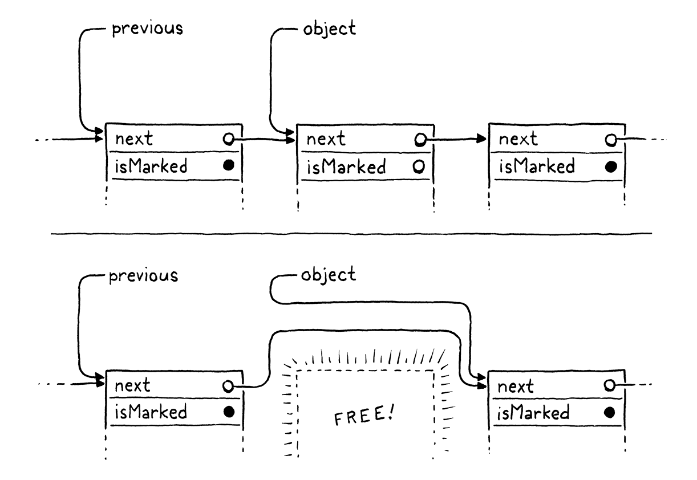
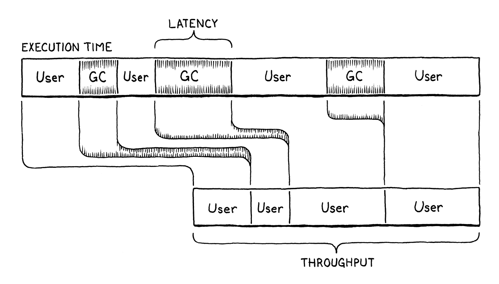

# Garbage Collection

We say Lox is a "high-level" language because it frees programmers from worrying about details irrelevant to the problem
they're solving. The user becomes an executive, giving the machine abstract goals and letting the lowly computer figure 
out how to get there.

Dynamic memory allocation is a perfect candidate for automation. It's necessary for a working program, tedious to do by
hand, and yet still error-prone. The inevitable mistakes can be catastrophic, leading to crashes, memory corruption, or
security violations. It's the kind of risky-yet-boring work that machines excel at over humans.

This is why Lox is a **managed language**, which means that the language implementation manages memory allocation and 
freeing on the user's behalf. When a user performs an operation that requires some dynamic memory, the VM automatically
allocates it. The programmer never worries about deallocating anything. The machine ensures any memory the program is 
using sticks around as long as needed.

Lox provides the illusion that the computer has an infinite amount of memory. Users can allocate and allocate and 
allocate and never once think about where all these bytes are coming from. Of course, computers do not yet *have* 
infinite memory. So the way managed languages maintain this illusion is by going behind the programmer's back and 
reclaiming memory that the program no longer needs. The component that does this is called a **garbage collector**.

> Recycling would really be a better metaphor for this. The GC doesn't *throw away* the memory, it reclaims it to be 
> reused for new data. But managed languages are older than Earth Day, so the inventors went with the analogy they knew.


## Reachability

This raises a surprisingly difficult question: how does a VM tell what memory is *not* needed? Memory is only needed if 
it is read in the future, but short of having a time machine, how can an implementation tell what code the program 
*will* execute and which data it *will* use? Spoiler alert: VMs cannot travel into the future. Instead, the language 
makes a conservative approximation: it considers a piece of memory to still be in use if it *could possibly* be read in
the future.

> A **conservative GC** is a special kind of collector that considers any piece of memory to be a pointer if the value
> in there looks like it could be an address. This is in contrast to a **precise GC** - which is what we'll implement -
> that knows exactly which words in memory are pointers and which store other kinds of values like numbers or strings.

That sounds *too* conservative. Couldn't *any* bit of memory potentially be real? Actually, no, at least not in a 
memory-safe language like Lox. E.g.:
```shell
var a = "first value";
a = "updated";
// GC here
print a;
```
Say we run the GC after the assignment has completed on the second line. The string "first value" is still sitting in 
memory, but there is no way for the user's program to ever get to it. Once `a` got reassigned, the program lost any 
reference to that string. We can safely free it. A value is **reachable** if there is some way for a user program to 
reference it. Otherwise, like the string "first value" here, it is **unreachable**.

Many values can be directly accessed by the VM. Take a look at:
```shell
var global = "string";
{
  var local = "another";
  print global + local;
}
```
Pause the program right after the two strings have been concatenated but before the `print` statement has executed. The 
VM can reach `"string"` by looking through the global variable table and finding the entry for `global`. It can find 
`"another"` by walking the value stack and hitting the slot for the local variable `local`. It can even find the 
concatenated string `"stringanother"` since that temporary value is also sitting on the VM's stack at the point when we
pause our program.

All of these values are called **roots**. A root is any object that the VM can reach directly without going through a
reference in some other object. Most roots are global variables or on the stack, but as we'll see, there are a couple of
other places the VM stores references to objects that it can find.

Other values can be found by going through a reference inside another value. Fields on instances of classes are the most
obvious case, but we don't have those yet. Even without those, our VM still has indirect reference. Consider:
```shell
fun makeClosure() {
  var a = "data";
  
  fun f() { print a; }
  return f;
}

{
  var closure = makeClosure();
  // GC here
  closure();
}
```
Say we pause the program on the marked line and run the garbage collector. When the collector is done and the program 
resumes, it will call the closure, which will in turn print `"data"`. So the collector needs to *not* free that string.

The `"data"` string is nowhere on it. It has already been hoisted off the stack and moved into the closed upvalue that 
the closure uses. The closure itself is on the stack. But to get to the string, we need to trace through the closure and
its upvalue array. Since it *is* possible for the user's program to do that, all of these indirectly accessible objects
are also considered reachable.


This gives us an inductive definition of reachability:
* All roots are reachable.
* Any object referred to from a reachable object is itself reachable.

These are the values that are still "live" and need to stay in memory. Any value that *doesn't* meet this definition is 
fair game for the collector to reap. That recursive pair of rules hints at a recursive algorithm we can use to free up
unneeded memory:
1. Starting with the roots, traverse through object references to find the full set of reachable objects.
2. Free all objects *not* in that set.

Many different garbage collection algorithms are in use today, but they all roughly follow that same structure. Some may
interleave the steps or mix them, but the two fundamental operations are there. They mostly differ in *how* they perform
each step.


## Mark-Sweep Garbage Collection

The first managed language was Lisp, the second "high-level" language to be invented, right after Fortran. John McCarthy
considerd using manual memory management or reference counting, but eventually settled on (and coined) garbage 
collection - once the program was out of memory, it would go back and find unused storage it could reclaim.

He designed the very first, simplest garbage collection algorithm, called **mark-and-sweep** or just **mark-sweep**. Its
description fits in three short paragraphs in the initial paper on Lisp. Despite its age and simplicity, the same 
fundamental algorithm underlies many modern memory managers. Some corners of CS seem to be timeless.

>> In John McCarthy's "History of Lisp", he notes: "Once we decided on garbage collection, its actual implementation 
> could be postponed, because only toy examples were being done." Our choice to procrastinate adding the GC to clox 
> follows in the footsteps of giants.

As the name implies, mark-sweep works in two phases:
* **Marking**: We start with the roots and traverse or *trace* through all of the objects those roots refer to. This is
    classic graph traversal of all of the reachable objects. Each time we visit an object, we *mark* it in some way.
    (Implementations differ in how they record the mark.)
>> A **tracing garbage collector** is any algorithm that traces through the graph of object references. This is in 
> contrast with reference counting, which has a different strategy for tracking the reachable objects.
* **Sweeping**: Once the mark phase completes, every reachable object in the heap has been marked. That means any
    unmarked object is unreachable and ripe for reclamation. We go through all the unmarked objects and free each one.

It looks something like this:

 

That's what we're gonna implement. Whenever we decide it's time to reclaim some bytes, we'll trace everything and mark 
all the reachable objects, free what didn't get marked, and then resume the user's program.

### *Collecting garbage*


## Tracing Object References

The next step in the parking process is tracing through the graph of references between objects to find the indirectly
reachable values. We don't have instances with fields yet, so there aren't many objects that contain references, but we
do have some. In particular, ObjClosure has the list of ObjUpvalues it closes over as well as a reference to the raw
ObjFunction that it wraps. ObjFunction, in turn, has a constant table contaning references to all of the literals 
created in the function's body. This is enough to build a fairly complex web of objects for out collector to crawl 
through.

Now it's time to implement that traversal. We do go breadth-first, depth-first, or in some other order. Since we just 
need to find the *set* of all reachable objects, the order we visit them mostly doesn't matter.

> "mostly", bc some GCs move objects in the order they are visited, so traversal order determines which objects end up
> adjacent in memory. That impacts performance bc the CPU uses locality to determine which memory to preload into the 
> caches.
> 
> Even when traversal order does matter, it's not clear which order is *best*. It's very difficult to determine which
> order objects will be used in in the future, so it's hard for the GC to know which order will help performance.

### *The tricolor abstraction*

As the collector wanders through the graph of objects, we need to make sure it doesn't lose track of where it is or get
stuck going in circles. This is particularly a concern for advanced implementations like incremental GCs that interleave
marking with running pieces of the user's program. The collector needs to be able to pause and then pick up where it 
left off later.

> Advanced GC algorithms often add other colors to the abstraction. I've seen multiple shades of gray, and even purple 
> in some designs.

The help us soft-brained humans reason about this complex process, VM hackers came up with a metaphor called the 
**tricolor abstraction**. Each object has a conceptual "color" that tracks what state the object is in, and what work is
left to do.
* **White**: At the beginning of a GC, every object is white. This color means we have not reached or processed the 
    object at all.
* **Gray**: During marking, when we first reach an object, we darken it gray. This color means we know the object itself
    is reachable and should not be collected. But we have not yet traced *through* it to see what *other* objects it 
    references. In graph algorithm terms, this is the *worklist* - the set of objects we know about but haven't 
    processed yet.
* **Black**: When we take a gray object and mark all of the objects it references, we then turn the gray object black.
    This color means the mark phase is done processing that object.

In terms of that abstraction, the marking process now looks like this:
1. Start off with all objects white.
2. Find all the roots and mark them gray.
3. Repeat as long as there are still gray objects:
   1. Pick a gray object. Turn any white objects that the object mentions to gray.
   2. Mark the original gray object black.


At the end, you're left with a sea of reached, black objects sprinkled with islands of white objects that can be swept 
up and freed. Once the unreachable objects are freed, the remaining objects - all black - are reset to white for the 
next GC cycle.

> Note that at every step of this process no black node ever points to a white node. This property is called the 
> **tricolor invariant**. The traversal process maintains this invariant to ensure that no reachable object is ever
> collected.

### *A worklist for gray objects*

In our implementation we have already marked the roots. They're all gray. The next step is to start picking them and 
traverse their references. But we don't have any easy way to find them. We set a field on the object, but that's it. We
don't want to have to traverse the entire object list looking for objects with that field set.

Instead, we'll create a separate worklist to keep track of all of the gray objects. When an object turns gray, in 
addition to setting the mark field we'll also add it to the worklist.

### *Processing gray objects*

OK, now when we're done marking the roots, we have both set a bunch of fields and filled our work list with objects to
chew through. It's time for the next phase.


If the object is already marked, we don't mark it again and thus don't add it to the gray stack. This ensures that an
already-gray object is not redundantly added and that a black object is not inadvertently turned back to gray. In other
words, it keeps the wavefront moving forward through only the white objects.


## Sweeping Unused Objects

When the loop in `traceReferences()` exits, we have processed all the objects we could get our hands on. The gray stack 
is empty, and every object  in the heap is either black or white. The black objects are reachable, and we want to hang
on to them. Anything still white never got touched by the trace and is thus garbage.

The process of `sweep()` is like:



Most of the other code in here deals with the fact that removing a node from a singly linked list is cumbersome. We have
to continuously remember the previous node so we can unlink its next pointer, and we have to handle the edge case where
we are freeing the first node. But, otherwise, it's pretty simple - delete every node in a linked list that doesn't have
a bit set in it.

### *Weak references and the string pool*

We are almost done collecting. There is one remaining corner of the VM that has some unusual requirements around memory.
Recall that when we added strings to clox we made the VM intern them all. That means the VM has a hash table containing
a pointer to every single string in the heap. The VM uses this to de-duplicate strings.

During the mark phase, we deliberately did *not* treat the VM's string table as a source of roots. If we had, no string
would *ever* be collected. The string table would grow and grow and never yield a single byte of memory back to the 
operating system. That would be bad.

At the same time, if we *do* let the GC free strings, then the VM's string table will be left with dangling pointers to
freed memory. That would be even worse.

> This can be a real problem. Java does not intern *all* strings, but it does intern string *literals*. It also provides
> an API to add strings to the string table. For many years, the capacity of that table was fixed, and strings added to
> it could never be removed. If users weren't careful about their use of `String.intern()`, they could run out of 
> memory and crash.
> 
> Ruby had a similiar problem for years where symbols - interned string-like values - were not garbage collected. Both
> eventually enabled the GC to collect these strings.

The string table is special and we need special support for it. In particular, it needs a special kind of reference. The
table should be able to refer to a string, but that like should not be considered a root when determining reachability.
That implies that the referenced object can be freed. When that happens, the dangling reference must be fixed too, sort
of like a magic, self-clearing pointer. This particular set of semantics comes up frequently enough that it has a name:
a [**weak reference**](https://en.wikipedia.org/wiki/Weak_reference).

We have already implicitly implemented half of the string table's unique behavior by virtue of the fact that we *don't*
traverse it during marking. That means it doesn't force strings to be reachable. The remaining piece is clearing out any
dangling pointers for strings that are freed.

To remove references to unreachable strings, we need to know which strings *are* unreachable. We don't know that until
after the mark phase has completed. But we can't wait until after the sweep phase is done because by then the objects -
and their mark bits - are no longer around to check. So the right time is exactly between the marking and sweeping 
phases.


## When to Collect

We have a fully functioning mark-sweep GC now. When the stress testing flag is enabled, it gets called all the time, and
with the logging enabled too, we can watch it do its thing and see that it is indeed reclaiming memory. But, when the 
stress testing flag is off, it never runs at all. It's time to decide when the collector should be invoked during normal
program execution.

As far as I can tell, this question is poorly answered by the literature. When GC were first invented, computers had a 
tiny, fixed amount of memory. Many of the early GC parsers assumed that you set aside a few thousand words of memory - 
in other words, most of it - and invoked the collector whenever you ran out. Simple.

Modern machines have gigs of physical RAM, hidden behind the operating system's even larger virtual memory abstraction, 
which is shared among a slew of other programs all fighting for their chunk of memory. The operating system will let 
your program request as much as it wants and then page in and out from the disc when physical memory gets full. You
never really "run out" of memory, you just get slower and slower.

### *Latency and throughput*

It no longer makes sense to wait until you "have to", to run the GC, so we need a more subtle timing strategy. To reason
about this more precisely, it's time to introduce two fundamental numbers used when measuring a memory manager's 
performance: *throughput* and *latency*.

Every managed language pays a performance price compared to explicit, user-authored deallocation. The time spent 
actually freeing memory is the same, but the GC spends cycles figuring out *which* memory to free. That is time *not* 
spent running the user's code and doing useful work. In our implementation, that's the entirety of the mark phase. The
goal of a sophisticated GC is to minimize that overload.

There are two key metrics we can use to understand that cost better:
* **Throughput** is the total fraction of time spent running user code versus doing GC work. Say you run a clox program
    for ten seconds and it spends a second of that inside `collectGarbage()`. That means the throughput is 90% - it 
    spent 90% of the time running the program and 10% on GC overhead.
    
    Throughput is the most fundamental measure because it tracks the total cost of collection overhead. All else being 
    equal, you want to maximize throughput. Up until this chapter, clox had no GC at all and thus 100% throughput. 
    That's pretty hard to beat. Of course, it came at the slight expense of potentially running out of memory and 
    crashing if the user's program ran long enough. You can look at the goal of a GC as fixing that "glitch" while 
    sacrificing as little throughput as possible.
    
* **Latency** is the longest *continuous* chunk of time where the user's program is completely paused while GC happens.
    It's a measure of how "chunky" the collector is. Latency is an entirely different metric than throughput.
    
    Consider two runs of a clox program that both take ten seconds. In the first run, the GC kicks in once and spends 
    a solid second in `collectGarbage()` in one massive collection. In the second run, the GC gets invoked five times,
    each for a fifth of a second. The *total* amount of time spent collecting is still a second, so the throughput is 
    90% in both cases. But in the second run, the latency is only 1/5th of a second, five times less than in the first.



> The bar represents the execution of a program, divided into time spent running user code and time spent in the GC. The
> size of the largest single slice of time running the GC is the latency. The size of all the user code slices added up
> is the throughput.

If you like analogies, imagine your program is a bakery selling fresh-baked bread to customers. Throughput is the total
number of warm, crusty baguettes you can serve to customers in a single day. Latency is how long the unluckiest customer
has to wait in line before they get served.

Running the GC is like shutting down the bakery temporarily to go through all the dishes, sort out the dirty from the 
clean, and then wash the used one. In our analogy, we don't have dedicated dishwashers, so while this is going on, no 
baking is happening. The baker is washing up.

Selling fewer loaves of bread a day is bad, and making any particular customer sit and wait while you clean all the 
dishes is too. The goal is to maximize throughput and minimize latency, but there is no free lunch, even inside a 
bakery. GCs make different trade-offs between how much throughput they sacrifice and latency they tolerate.


> If each person represents a thread, then an obvious optimization is to have separate threads running GC, giving you
> a **concurrent GC**. In other words, hire some dishwashers to clean while others bake. This is how very sophisticated
> GCs work bc it does let the bakers - the workers threads - keeping running user code with little interruption.
> 
> However, coordination is required. You don't want a dishwasher grabbing a bowl out of a baker's hands! This 
> coordination adds overhead and a lot of complexity. Concurrent collcetors are fast, but challenging to implement
> correctly.

Being able to make these trade-offs is useful bc different user programs have different needs. An overnight batch job
that is generating a report from a terabyte of data just needs to get as much work done as fast possible. Throughput is 
queen. Meanwhile, an app running on a user's smartphone needs to always respond immediately to user input so that 
dragging on the screen feels buttery smooth. The app can't freeze for a few seconds while the GC mucks around in the 
heap.


Our collector is a **stop-the-world GC** which means the user's program is paused until the entire garbage collection
process has completed. If we wait a long time before we run the collector, then a large number of dead objects will
accumulate. That leads to a very long pause while the collector runs, and thus high latency. So, clearly, we want to run
the collector really frequently.

> In contrast, an **incremental garbage collector** can do a little collection, then run some user code, then collect a
> little more, and so on.

But every time the collector runs, it spends some time visiting live objects. That doesn't really *do* anything useful
(aside from ensuring that they don't incorrectly get deleted). Time visiting live objects is time not freeing memory and
also time not running user code. If you run the GC *really* frequently, then the user's program doesn't have enough time
to even generate new gargabe for the VM to collect. The VM will spend all its time obsessively revisiting the same set 
of live objects over and over, and throughput will suffer. So, clearly, we want to run the collector really 
*in*frequently.

In fact, we want something in the middle, and the frequency of when the collector runs is one of our main knobs for
tuning the trade-off between latency and throughput.


### *Self-adjusting heap*

We want our GC to run frequently enough to minimize latency but infrequently enough to maintain decent throughput. But 
how do we find the balance between these when we have no idea how much memory the user's program needs and how often it
allocates? We could pawn the problem onto the user and force them to pick by exposing GC tuning parameters. Many VMs do
this. But if we, the GC authors, don't know how to tune ti well, odds are good most users won't either. They deserve a
reasonable default behavior.


The strategy here is common and pretty simple.

The idea is that the collector frequency automatically adjusts based on the live size of the heap. We track the total 
number of bytes of managed memory that the VM has allocated. When it goes above some threshold, we trigger a GC. After
that, we note how many bytes of memory remain - how many were *not* freed. Then we adjust the threshold to some value 
larger than that.

The result is that as the amount of live memory increases, we collect less frequently in order to avoid sacrificing
throughput by re-traversing the growing pile of live objects. As the amount of live memory goes down, we collect more
frequently so that we don't lose too much latency by waiting too long.


## Garbage Collection Bugs

In theory, we are all done now. We have a GC. It kicks in periodically, collects what it can, and leaves the rest. 

But sometimes there is painful reality, and GC bugs really are some of the grossest invertebrates out there.

The collector's job is to free dead objects and preserve live ones. Mistakes are easy to make in both directions. If the
VM fails to free objects that aren't needed, it slowly leaks memory. These failures often don't immediately cause a 
crash, which makes it hard for us to track backward in time to find the bug.

This is made harder by the fact that we don't know when the collector will run. Any call that eventually allocates some
memory is a place in the VM where a collection could happen. It's like musical chairs. At any point, the GC might stop
the music. Every single heap-allocated object that we want to keep needs to find a chair quickly - get marked as a root
or stored as a reference in some other object - before the sweep phase comes to kick it out of the game.

How 