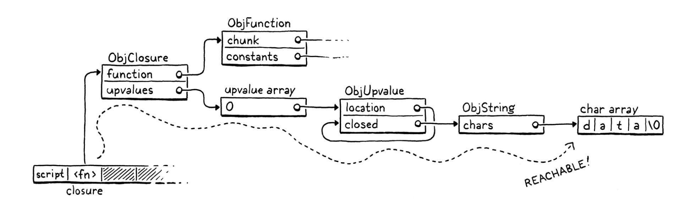
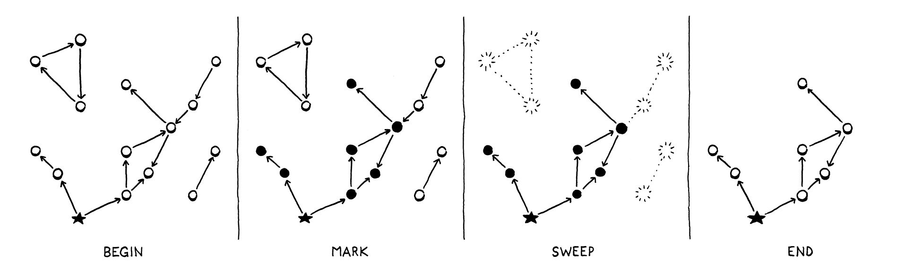
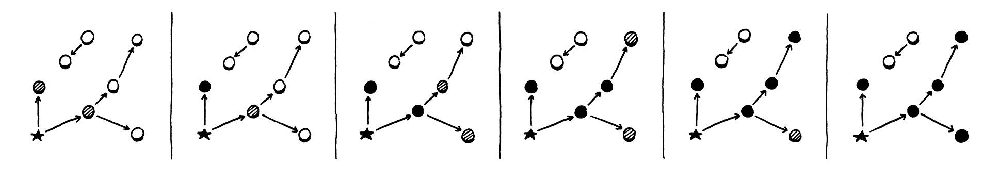

# Garbage Collection

We say Lox is a "high-level" language because it frees programmers from worrying about details irrelevant to the problem
they're solving. The user becomes an executive, giving the machine abstract goals and letting the lowly computer figure 
out how to get there.

Dynamic memory allocation is a perfect candidate for automation. It's necessary for a working program, tedious to do by
hand, and yet still error-prone. The inevitable mistakes can be catastrophic, leading to crashes, memory corruption, or
security violations. It's the kind of risky-yet-boring work that machines excel at over humans.

This is why Lox is a **managed language**, which means that the language implementation manages memory allocation and 
freeing on the user's behalf. When a user performs an operation that requires some dynamic memory, the VM automatically
allocates it. The programmer never worries about deallocating anything. The machine ensures any memory the program is 
using sticks around as long as needed.

Lox provides the illusion that the computer has an infinite amount of memory. Users can allocate and allocate and 
allocate and never once think about where all these bytes are coming from. Of course, computers do not yet *have* 
infinite memory. So the way managed languages maintain this illusion is by going behind the programmer's back and 
reclaiming memory that the program no longer needs. The component that does this is called a **garbage collector**.

> Recycling would really be a better metaphor for this. The GC doesn't *throw away* the memory, it reclaims it to be 
> reused for new data. But managed languages are older than Earth Day, so the inventors went with the analogy they knew.


## Reachability

This raises a surprisingly difficult question: how does a VM tell what memory is *not* needed? Memory is only needed if 
it is read in the future, but short of having a time machine, how can an implementation tell what code the program 
*will* execute and which data it *will* use? Spoiler alert: VMs cannot travel into the future. Instead, the language 
makes a conservative approximation: it considers a piece of memory to still be in use if it *could possibly* be read in
the future.

> A **conservative GC** is a special kind of collector that considers any piece of memory to be a pointer if the value
> in there looks like it could be an address. This is in contrast to a **precise GC** - which is what we'll implement -
> that knows exactly which words in memory are pointers and which store other kinds of values like numbers or strings.

That sounds *too* conservative. Couldn't *any* bit of memory potentially be real? Actually, no, at least not in a 
memory-safe language like Lox. E.g.:
```shell
var a = "first value";
a = "updated";
// GC here
print a;
```
Say we run the GC after the assignment has completed on the second line. The string "first value" is still sitting in 
memory, but there is no way for the user's program to ever get to it. Once `a` got reassigned, the program lost any 
reference to that string. We can safely free it. A value is **reachable** if there is some way for a user program to 
reference it. Otherwise, like the string "first value" here, it is **unreachable**.

Many values can be directly accessed by the VM. Take a look at:
```shell
var global = "string";
{
  var local = "another";
  print global + local;
}
```
Pause the program right after the two strings have been concatenated but before the `print` statement has executed. The 
VM can reach `"string"` by looking through the global variable table and finding the entry for `global`. It can find 
`"another"` by walking the value stack and hitting the slot for the local variable `local`. It can even find the 
concatenated string `"stringanother"` since that temporary value is also sitting on the VM's stack at the point when we
pause our program.

All of these values are called **roots**. A root is any object that the VM can reach directly without going through a
reference in some other object. Most roots are global variables or on the stack, but as we'll see, there are a couple of
other places the VM stores references to objects that it can find.

Other values can be found by going through a reference inside another value. Fields on instances of classes are the most
obvious case, but we don't have those yet. Even without those, our VM still has indirect reference. Consider:
```shell
fun makeClosure() {
  var a = "data";
  
  fun f() { print a; }
  return f;
}

{
  var closure = makeClosure();
  // GC here
  closure();
}
```
Say we pause the program on the marked line and run the garbage collector. When the collector is done and the program 
resumes, it will call the closure, which will in turn print `"data"`. So the collector needs to *not* free that string.

The `"data"` string is nowhere on it. It has already been hoisted off the stack and moved into the closed upvalue that 
the closure uses. The closure itself is on the stack. But to get to the string, we need to trace through the closure and
its upvalue array. Since it *is* possible for the user's program to do that, all of these indirectly accessible objects
are also considered reachable.



This gives us an inductive definition of reachability:
* All roots are reachable.
* Any object referred to from a reachable object is itself reachable.

These are the values that are still "live" and need to stay in memory. Any value that *doesn't* meet this definition is 
fair game for the collector to reap. That recursive pair of rules hints at a recursive algorithm we can use to free up
unneeded memory:
1. Starting with the roots, traverse through object references to find the full set of reachable objects.
2. Free all objects *not* in that set.

Many different garbage collection algorithms are in use today, but they all roughly follow that same structure. Some may
interleave the steps or mix them, but the two fundamental operations are there. They mostly differ in *how* they perform
each step.


## Mark-Sweep Garbage Collection

The first managed language was Lisp, the second "high-level" language to be invented, right after Fortran. John McCarthy
considerd using manual memory management or reference counting, but eventually settled on (and coined) garbage 
collection - once the program was out of memory, it would go back and find unused storage it could reclaim.

He designed the very first, simplest garbage collection algorithm, called **mark-and-sweep** or just **mark-sweep**. Its
description fits in three short paragraphs in the initial paper on Lisp. Despite its age and simplicity, the same 
fundamental algorithm underlies many modern memory managers. Some corners of CS seem to be timeless.

>> In John McCarthy's "History of Lisp", he notes: "Once we decided on garbage collection, its actual implementation 
> could be postponed, because only toy examples were being done." Our choice to procrastinate adding the GC to clox 
> follows in the footsteps of giants.

As the name implies, mark-sweep works in two phases:
* **Marking**: We start with the roots and traverse or *trace* through all of the objects those roots refer to. This is
    classic graph traversal of all of the reachable objects. Each time we visit an object, we *mark* it in some way.
    (Implementations differ in how they record the mark.)
>> A **tracing garbage collector** is any algorithm that traces through the graph of object references. This is in 
> contrast with reference counting, which has a different strategy for tracking the reachable objects.
* **Sweeping**: Once the mark phase completes, every reachable object in the heap has been marked. That means any
    unmarked object is unreachable and ripe for reclamation. We go through all the unmarked objects and free each one.

It looks something like this:

 

That's what we're gonna implement. Whenever we decide it's time to reclaim some bytes, we'll trace everything and mark 
all the reachable objects, free what didn't get marked, and then resume the user's program.

### *Collecting garbage*


## Tracing Object References

The next step in the parking process is tracing through the graph of references between objects to find the indirectly
reachable values. We don't have instances with fields yet, so there aren't many objects that contain references, but we
do have some. In particular, ObjClosure has the list of ObjUpvalues it closes over as well as a reference to the raw
ObjFunction that it wraps. ObjFunction, in turn, has a constant table contaning references to all of the literals 
created in the function's body. This is enough to build a fairly complex web of objects for out collector to crawl 
through.

Now it's time to implement that traversal. We do go breadth-first, depth-first, or in some other order. Since we just 
need to find the *set* of all reachable objects, the order we visit them mostly doesn't matter.

> "mostly", bc some GCs move objects in the order they are visited, so traversal order determines which objects end up
> adjacent in memory. That impacts performance bc the CPU uses locality to determine which memory to preload into the 
> caches.
> 
> Even when traversal order does matter, it's not clear which order is *best*. It's very difficult to determine which
> order objects will be used in in the future, so it's hard for the GC to know which order will help performance.

### *The tricolor abstraction*

As the collector wanders through the graph of objects, we need to make sure it doesn't lose track of where it is or get
stuck going in circles. This is particularly a concern for advanced implementations like incremental GCs that interleave
marking with running pieces of the user's program. The collector needs to be able to pause and then pick up where it 
left off later.

> Advanced GC algorithms often add other colors to the abstraction. I've seen multiple shades of gray, and even purple 
> in some designs.

The help us soft-brained humans reason about this complex process, VM hackers came up with a metaphor called the 
**tricolor abstraction**. Each object has a conceptual "color" that tracks what state the object is in, and what work is
left to do.
* **White**: At the beginning of a GC, every object is white. This color means we have not reached or processed the 
    object at all.
* **Gray**: During marking, when we first reach an object, we darken it gray. This color means we know the object itself
    is reachable and should not be collected. But we have not yet traced *through* it to see what *other* objects it 
    references. In graph algorithm terms, this is the *worklist* - the set of objects we know about but haven't 
    processed yet.
* **Black**: When we take a gray object and mark all of the objects it references, we then turn the gray object black.
    This color means the mark phase is done processing that object.

In terms of that abstraction, the marking process now looks like this:
1. Start off with all objects white.
2. Find all the roots and mark them gray.
3. Repeat as long as there are still gray objects:
   1. Pick a gray object. Turn any white objects that the object mentions to gray.
   2. Mark the original gray object black.



At the end, you're left with a sea of reached, black objects sprinkled with islands of white objects that can be swept 
up and freed. Once the unreachable objects are freed, the remaining objects - all black - are reset to white for the 
next GC cycle.

> Note that at every step of this process no black node ever points to a white node. This property is called the 
> **tricolor invariant**. The traversal process maintains this invariant to ensure that no reachable object is ever
> collected.

### *A worklist for gray objects*

In our implementation we have already marked the roots. They're all gray. The next step is to start picking them and 
traverse their references. But we don't have any easy way to find them. We set a field on the object, but that's it. We
don't want to have to traverse the entire object list looking for objects with that field set.

Instead, we'll create a separate worklist to keep track of all of the gray objects. When an object turns gray, in 
addition to setting the mark field we'll also add it to the worklist.

### *Processing gray objects*

OK, now when we're done marking the roots, we have both set a bunch of fields and filled our work list with objects to
chew through. It's time for the next phase.


If the object is already marked, we don't mark it again and thus don't add it to the gray stack. This ensures that an
already-gray object is not redundantly added and that a black object is not inadvertently turned back to gray. In other
words, it keeps the wavefront moving forward through only the white objects.