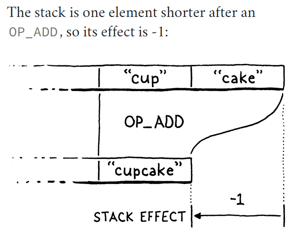

# Global Variables

In jlox, we managed to cram the variables (Global/Local) into a single chapter because we use the same implementation 
technique for all variables. We built a chain of environments, one for each scope, all the way up to the top. That was a
simple, clean way to learn how to manage the state.

But it's also *slow*. Allocating a new hash table each time you enter a block or call a function is not the road to a 
fast VM. Given how much code is concerned with using variables, if variables go slow, everything goes slow. For clox, 
we'll improve that by using a much more efficient strategy for local variables, but globals aren't as easily optimized.

> This is a common meta-strategy in sophisticated language implementations. Often, the same language feature will have 
> multiple implementation techniques, each tuned for different use patterns. E.g., JavaScript VMs often have a faster 
> representation for objects that are used more like instances of classes compared to other objects whose set of 
> properties is more freely modified. C/C++ compilers usually have a variety of ways to compile `switch` statements 
> based on the number of cases and how densely packed the case values are.

A quick refresher on Lox semantics: Global variables in Lox are "late bound", or resolved dynamically. This means you 
can compile a chunk of code that refers to a global variable before it's defined. As long as the code doesn't *execute* 
before the definition happens, everything is fine. In practice, that means you can refer to later variables inside the 
body of functions.
```shell
fun showVariable() {
    print global;
}

var global = "after";
showVariable();
```
Code like this might seem odd. But it's handy for defining mutually recursive functions. It also plays nicer with the 
REPL. You can write a little function in one line, then define the variable it uses in the next.

Local variables work differently. Since a local variable's definition *always* occurs before it is used, the VM can 
resolve them at compile time, even in a simple single-pass compiler. That will let us use a smarter representation for 
locals.

## Statements

Variables come into being using variable declarations, which means now is also the time to add support for statements to
our compiler. If you recall, Lox splits statements into two categories. "Declarations" are those statements that bind a 
new name to a value. The other kinds of statements - control flow, print, etc. - are just called "statements". We 
disallow declarations directly inside control flow statements, like this:
```shell
if (monday) var croissant = "yes";   // Error
```

Allowing it would raise confusing questions around the scope of the variable. So, like other languages, we prohibit it 
syntactically by having a separate grammar rule for the subset of statements that *are* allowed inside a control flow 
body.
```shell
statement       -> exprStmt
                 | forStmt
                 | ifStmt
                 | printStmt
                 | returnStmt
                 | whileStmt
                 | block ;
```
Then we use a separate rule for the top level of a script and inside a block.
```shell
declaration     -> classDecl
                 | funDecl
                 | varDecl
                 | statement ;
```
The `declaration` rule contains the statements that declare names, and also includes `statement` so that all statement 
types are allowed. Since `block` itself is in `statement`, you can put declarations inside a control flow construct by 
nesting them inside a block.

> Blocks work sort of like parentheses do for expressions. A block lets you put the "lower-precedence" declaration 
> statements in places where only a "higher-precedence" non-declaring statement is allowed.

In this chapter, we'll cover only a couple of statements and one declaration.
```shell
statement        -> exprStmt
                  | printStmt ;
                  
declaration      -> varDecl
                  | statement ;          
```

### *Print statement*

Note that we don't push anything else after that. This is a key difference between expressions and statements in the VM.
Every bytecode instruction has a **stack effect** that describe how the instruction modifies the stack. E.g., `OP_ADD` 
pops two values and pushes one, leaving the stack one element smaller than before.

You can sum the stack effects of a series of instructions to get their total effect. When you add the stack effects of 
the series of instructions compiled from any complete expression, it will total one. Each expression leaves one result 
value on the stack.


The bytecode for an entire statement has a total stack effect of zero. Since a statement produces no values, it 
ultimately leaves the stack unchanged, though it of course uses the stack while it's doing its thing. This is important
because when we get to control flow and looping, a program might execute a long series of statements. If each statement
grew or shrank the stack, it might eventually overflow or underflow.

## Variable Declarations

Merely being able to *print* doesn't win your language any prizes at the programming language fair, so let's move on to
something a little more ambitious and get variables going. There are three operations we need to support:

* Declaring a new variable using a `var` statement
* Accessing the value of a variable using an identifier expression
* Storing a new value in an existing variable using an assignment expression.

## Reading Variables

