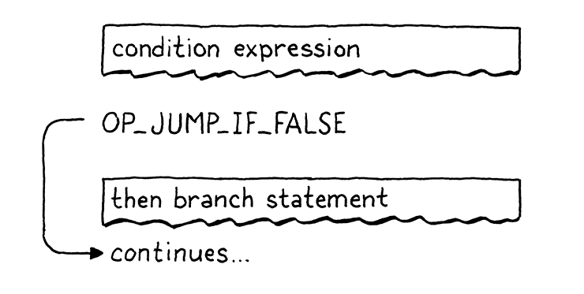
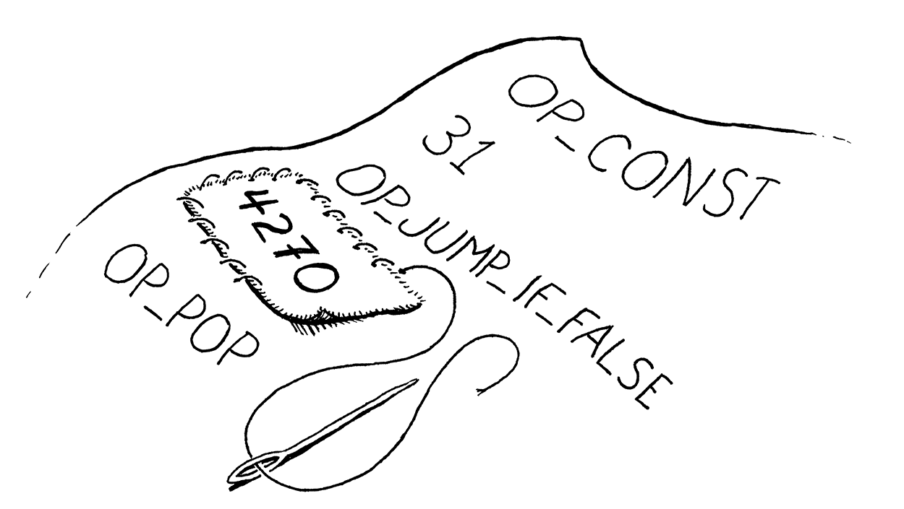
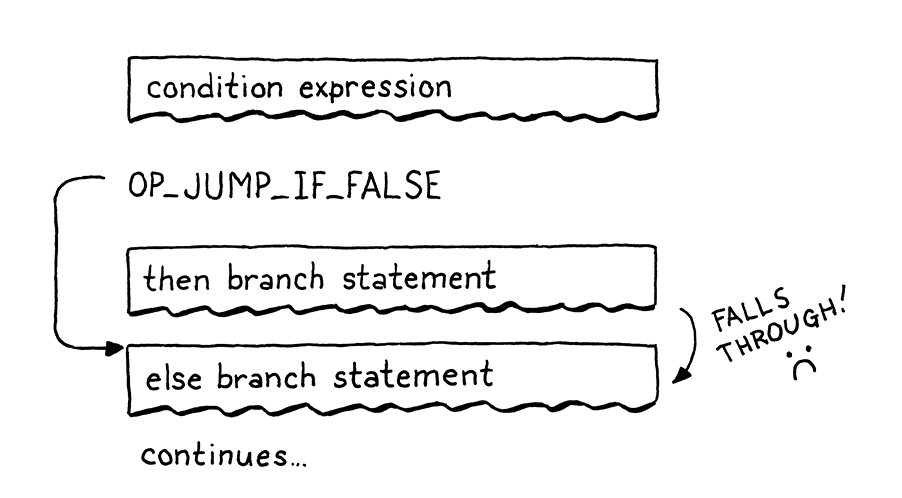
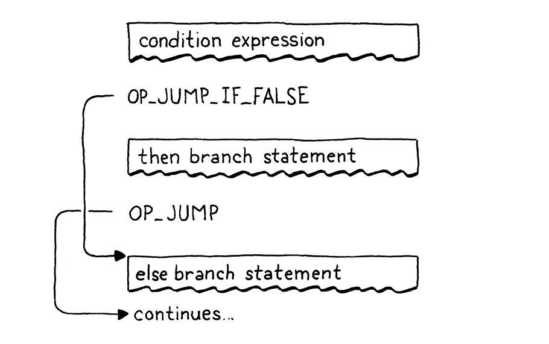
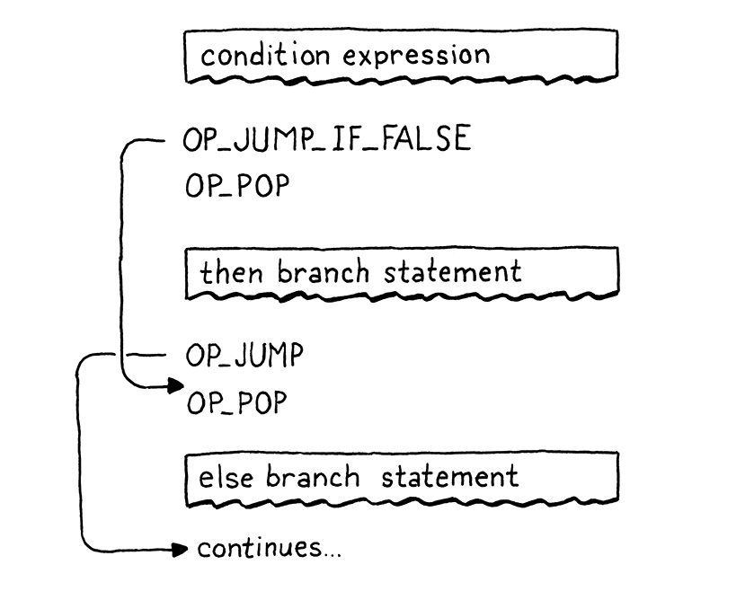
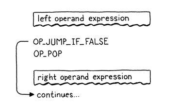
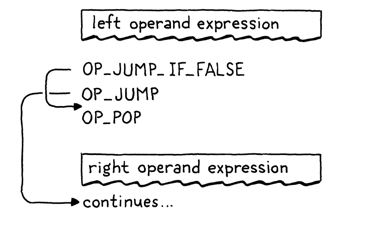
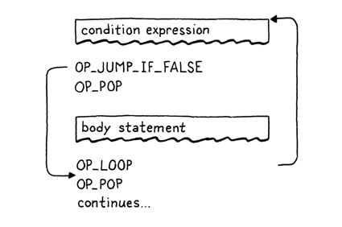

# Jumping Back and Forth

## If Statement

First, we compile the condition expression, bracketed by parentheses. At runtime, that will leave the condition value on 
top of the stack. We'll use that to determine whether to execute the then branch or skip it.

> Have you ever noticed that the `(` after the `if` keyword doesn't actually do anything useful? The language would be 
> just as unambiguous and easy to parse without it, like:
> `if condition) print ("looks weird");`
> The closing `)` is useful because it separates the condition expression from the body. Some language uses a `then` 
> keyword instead. But the opening `(` doesn't do anything. It's just there because unmatched parentheses look bad to us
> humans.

Then we emit a new `OP_JUMP_IF_FALSE` instruction. It has an operand for how much to offset the `ip` - how many bytes of
code to skip. If the condition is falsey, it adjusts the `ip` by that amount. Something like this:

But we have a problem. When we're writing the `OP_JUMP_IF_FALSE` instruction's operand, how do we know how far to jump?
We haven't compiled the then branch yet, so we don't know how much bytecode it contains.

To fix that, we use a classic trick called **backpatching**. We emit the jump instruction first with a placeholder 
offset operand. We keep track of where that half-finished instruction is. Next, we compile the then body. Once that's 
done, we know how far to jump. So we go back and replace that placeholder offset with the real one now that we can 
calculate it. Sort of like sewing a patch onto the existing fabric of the compiled code.

After reading the offset, we check the condition value on top of the stack. If it's falsey, we apply this jump offset to
the `ip`. Otherwise, we leave the `ip` alone and execution will automatically proceed to the next instruction following 
the jump instruction.

In the case where the condition is falsey, we don't need to do any other work. We've offset the `ip`, so when the outer
instruction dispatch loop turns again, it will pick up execution at that new instruction, past all the code in then 
branch.

Note that the jump instruction doesn't pop the condition value off the stack. So we aren't totally done here, since this
leaves an extra value floating around on the stack. We'll clean that up soon. Ignoring that for the moment, we do have 
a working `if` statement in Lox now, with only one little instruction required to support it at runtime in the VM.

### *Else clauses*

An `if` statement without support for `else` clauses is like Morticia Addams w/o Gomez. So, after we compile the then
branch, we look for an `else` keyword. If we find one, we compile the else branch.

When the condition is falsey, we'll jump over the then branch. If there's an else branch, the `ip` will land at the 
beginning of its code. But that's not enough, though. Here's the flow that leads to:

If the condition is truthy, we execute the then branch like we want. But after that, execution rolls right on through 
into the else branch. Oops! When the condition is true, after we run the then branch, we need to jump over the else 
branch. That way, in either case, we only execute a single branch, like this:

Compared with `OP_JUMP_IF_FALSE`, the `OP_JUMP` doesn't check a condition and always applies the offset.

We have then and else branches working now, so we're close. The last bit is to clean up that condition value we left on
the stack. Remember, each statement is required to have zero stack effect - after the statement is finished executing, 
the stack should be as tall as it was before.

We could have the `OP_JUMP_IF_FALSE` instruction pop the condition itself, but soon we'll use that same instruction for 
the logical operators where we don't want the condition popped. Instead, we'll have the compiler emit a couple of 
explicit `OP_POP` instructions when compiling an `if` statement. We need to take care that every execution path through
the generated code pops the condition.

The full correct flow looks like this:

## Logical Operators

You probably remember this from jlox, but the logical operators `and` and `or` aren't just another pair of binary 
operators like `+` and `-`. Because they short-circuit and may not evaluate their right operand depending on the value 
of the left one, they work more like control flow expression.

They're basically a little variation on an `if` statement with an `else` clause. The easiest way to explain them is to 
just show you the compiler code and the control flow it produces in the resulting bytecode. Starting with `and`, we hook
it into the expression parsing table.

At the point this is called, the left-hand side expression has already been compiled. That means at runtime, its value 
will be on top of the stack. If that value is falsey, then we know the entire `and` must be false, so we skip the right 
operand and leave the left-hand side value as the result of the entire expression. Otherwise, we discard the left-hand
value and evaluate the right operand which becomes the result of the whole `and` expression.

Those four lines of code right there produce exactly that. The flow looks like this:

Now you can see why `OP_JUMP_IF_FALSE` leaves the value on top of the stack. When the left-hand side of the `and` is 
falsey, that value sticks around to become the result of the entire expression.

### *Logical or operator*

In an `or` expression, if the left-hand side is *truthy*, then we skip over the right operand. Thus we need to jump when
a value is truthy. We could add a separate instruction, but just to show how our compiler is free to map the language's
semantics to whatever instruction sequence it wants, I implemented it in terms of the jump instructions we already have.

When the left-hand side is falsey, it does a tiny jump over the next statement. That statement is an unconditional jump
over the code for the right operand. This little dance effectively does a jump when the value is truthy. The flow looks
like this:

This isn't the best way to do this. There are more instructions to dispatch and more overhead. There's no good reason
why `or` should be slower than `and`. But it is kind of fun to see that it's possible to implement both operators w/o
adding any new instructions.

## While Statements

That takes us to the *looping* statements, which jump *backward* so that code cna be executed more than once. Lox only 
has two loop constructs, `while` and `for`. A `while` loop is (much) simpler, so ew start the party here.

The `emitLoop()` is a bit like `emitJump()` and `patchJump()` combined. It emits a new loop instruction, which 
conditionally jumps *backwards* by a given offset. Like the jump instructions, after that we have a 16-bit operand. We 
calculate the offset from the instruction we're currently at to the `loopStart` point that we want to jump back to. The 
`+ 2` is to take into account the size of the `OP_LOOP` instruction's own operands which we also need to jump over.

From the VM's perspective, there really is no semantic difference between `OP_LOOP` and `OP_JUMP`. Both just add an 
offset to the `ip`. We could have used a single instruction for both and given it a signed offset operand. But I figured
it was a little easier to sidestep the annoying bit twiddling required to manually pack a signed 16-bit integer into two
bytes, and we've got the opcode space available, so why not use it?

The `while` statement contains two jumps - a conditional forward one to escape the loop when the condition is not met, 
and an unconditional loop backward after we have executed the body. The flow looks like this:

## For Statements

The other looping statement in Lox is the venerable `for` loop, inherited from C. It's got a lot more going on with it
compared to a `while` loop. It has three clauses, all of which are optional:

* The initializer can be a variable declaration or an expression. It runs once at the beginning of the statement.
* The condition clause is an expression. Like in a `while` loop, we exit the loop when it evaluates to something falsey.
* The increment expression runs once at the end of each loop iteration.

In jlox, the parser desugared a `for` loop to a synthesized AST for a `while` loop with some extra stuff before it and
at the end of the body. We'll do something similar, though we won't go through anything like an AST. Instead, our 
bytecode compiler will use the jump and loop instructions we already have.

