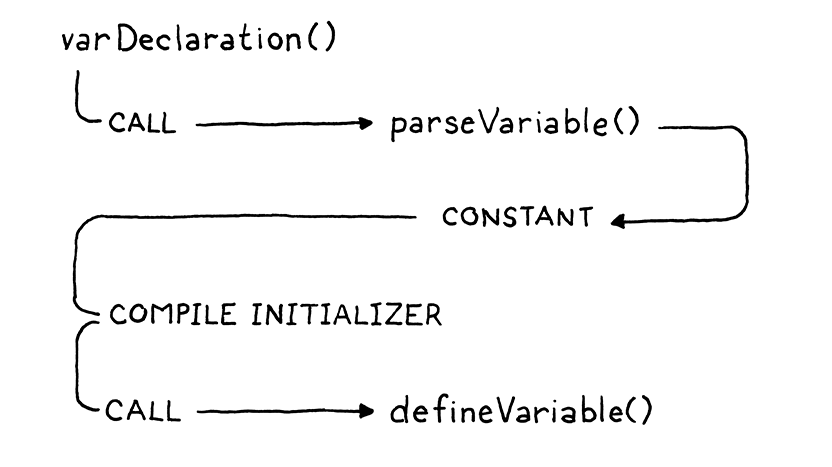
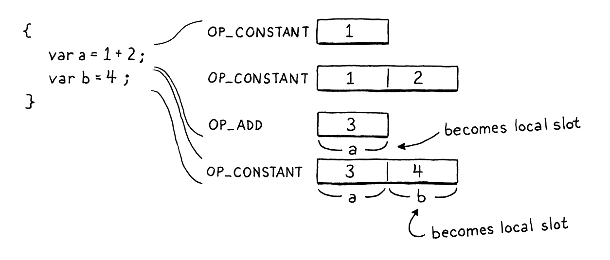

# Local Variable

## Representing Local Variables

Our compiler has the data it needs, but not the operations on that data. There's no way to create and destroy scopes, 
or add and resolve variables. We'll add those as we need them. First, let's start building some language features.

## Block Statements

Before we can have any local variables, we need some local scopes. These come from two things: function bodies and 
blocks. Functions are a big chunk of work that we'll tackle in a later chapter, so for now we're only going to do 
blocks. As usual, we start with the syntax. The new grammar we'll introduce is:
```shell
statement     -> exprStmt
               | printStmt
               | block ;
               
block         -> "{" declaration* "}" ;             
```
> When you think about it, "block" is a weird name. Used metaphorically, "block" usually means a small indivisible unit,
> but for some reason, the Algol 60 committee decided to use it to refer to a *compound* structure - a series of 
> statements. It could be worse, I suppose. Algol 58 called `begin` and `end` "statement parentheses".


## Declaring Local Variables

Usually we start with parsing here, but our compiler already supports parsing and compiling variable declarations. We've
got `var` statements, identifier expressions and assignment in here now. It's just that the compiler assumes all 
variables are global. So we don't need any new parsing support, we just need to hook up the new scoping semantics to the
existing code.


Variable declaration parsing begins in `varDeclaration()` and relies on a couple of other functions. First, 
`parseVariable()` consumes the identifier token for the variable name, adds its lexeme to the chunk's constant table as 
a string, and then returns the constant table index where it was added. Then, after `varDeclaration()` compiles the 
initializer, it calls `defineVariable()` to emit the bytecode for storing the variable's value in the global variable 
hash table.


There is no code to create a local variable at runtime. Think about what state the VM is in. It has already executed the
code for the variable's initializer (or the implicit `nil` if the user omitted an initializer), and that value is 
sitting right on top of the stack as the only remaining temporary. We also know that new locals are allocated at the top
of the stack...right where that value already is. Thus, there's nothing to do. The temporary simply *becomes* the local 
variable. It doesn't get much more efficient than that.



There is a trickier case:
```shell
{
  var a = "first";
  var a = "second";
}
```
At the top level, Lox allows redeclaration a variable with the same name as a previous declaration because that's useful
for the REPL. But inside a local scope, that's a pretty wired thing to do. It's likely to be a mistake, and many 
languages, including our own Lox, enshrine that assumption by make this an error.

Note that the above program is different from this one:
```shell
{
  var a = "outer";
  {
    var a = "inner";
  }
}
```
It's OK to have two variables with the same name in *different* scopes, even when the scopes overlap such that both are 
visible at the same time. That's shadowing, and Lox does allow that. It's only an error to have two variables with the 
same name in the *same* local scope.


When we pop a scope, we walk backward through the local array looking for any variables declared at the scope depth we 
just left. We discard them by simply decrementing the length of the array.

There is a runtime component to this too. Local variables occupy slots on the stack. When a local variable goes out of 
scope, that slot is no longer needed and should be freed. So, for each variable that we discard, we also emit an 
`OP_POP` instruction to pop it from the stack.

## Using Locals

We can now compile and execute local variable declarations. At runtime, their values are sitting where they should be on
the stack. Let's start using them. We'll do both variable access and assignment at the same time since they touch the 
same function in the compiler.


At runtime, we load and store locals using the stack slot index, so that's what the compiler needs to calculate after it
resolves the variable. Whenever a variable is declared, we append it to the locals array in Compiler. That means the 
first local variable is at index zero, the next one is at index one, and so on. In other words, the locals array in the 
compiler has the *exact* same layout as the VM's stack will have at runtime. The variable's index in the locals array is
the same as its stack slot. How convenient!

If we make it through the whole array without finding a variable with the given name, it must not be a local. In that 
case, we return `-1` to signal that it wasn't found and should be assumed to be a global variable instead.


### *Interpreting local variables*

### *Another scope edge case*

We already sunk some time into handling a couple of weird edge cases around scopes. We made sure shadowing works 
correctly. We report an error if two variables in the same local scope have the same name. For reasons that aren't 
entirely clear to me, variable scoping seems to have a lot of these wrinkles. I've never seen a language where it feels
completely elegant.

We've got one more edge case to deal with before we end this chapter. Recall this strange beastie we first met in 
[jlox's implementation of variable resolution](http://www.craftinginterpreters.com/resolving-and-binding.html#resolving-variable-declarations)
:
```shell
{
  var a = "outer";
  {
    var a = a;
  }
}
```
We slayed it then by splitting a variable's declaration into two phases, and we'll do that again here:


As soon as the variable declaration begins - in other words, before its initializer - the name is declared in the 
current scope. The variable exists, but in a special "uninitialized" state. Then we compile the initializer. If at any
point in that expression we resolve an identifier that points back to this variable, we'll see that it is not 
initialized yet and report an error. After we finish compiling the initializer, we makr the variable as initialized and 
ready for use.


If the variable has the sentinel depth, it must be a reference to a variable in its own initializer, and we report that 
as an error.

That's it for this chapter! We added blocks, local variables and real, honest-to-God lexical scoping. Given that we
introduce an entirely different runtime representation for variables, we didn't have to write a lot of code. The 
implementation ended up being pretty clean and efficient.

Over in the runtime, it's just two little instructions. You'll see this as a continuing trend in clox compared to jlox.
One of the biggest hammers in the optimizer's toolbox is pulling work forward into the compiler so that you don't have 
to do it at runtime. In this chapter, that means resolving exactly which stack slot every local variable occupies. That 
way, at runtime, no lookup or resolution needs to happen.