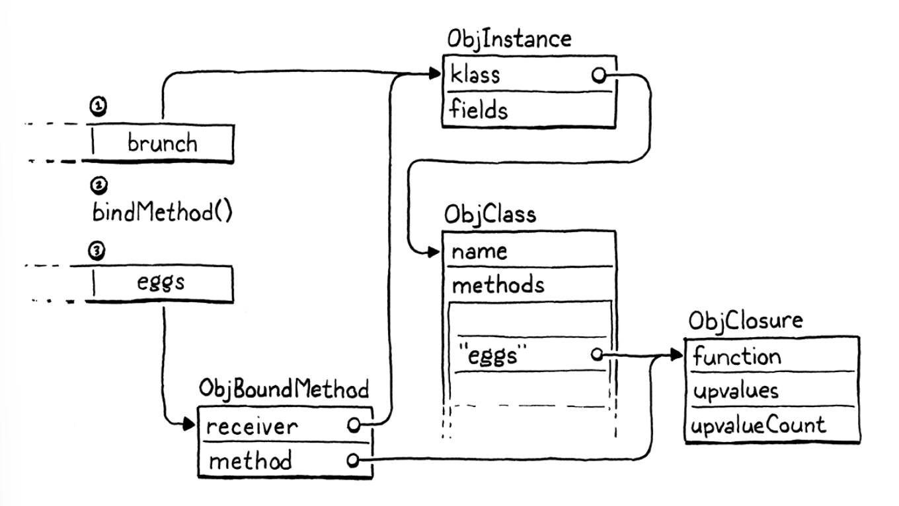

# Methods and Initializers

It is time for our VM to bring its nascent objects to life with behavior. That means methods and method calls. And, 
since they are a special kind of method, initializers too.

All this is familiar territory from our previous jlox interpreter. What's new in this second trip is an important 
optimization we'll implement to make method calls over seven times faster than our baseline performance. But before we
get to that fun, we gotta get the basic stuff working.

## Method Declarations

### Representing methods

We use the existing `markTable()` function, which traces through the key string and value in each table entry.

Storing a class's methods is pretty familiar coming from jlox. The different part is how that table gets populated. Our
previous interpreter had access to the entire AST node for the class declaration and all the methods it contained. At 
runtime, the interpreter simply walked that list of declarations.

Now every piece of information the compiler wants to shunt over to the runtime has to squeeze through the interface of a
flat series of bytecode instructions. 

### Compiling method declarations

Lox doesn't have field declarations, so anything before the closing brace at the end of the class body must be a method.
We stop compiling methods when we hit that final curly or if we reach the end of the file. The latter check ensures our
compiler doesn't get stuck in an infinite loop if the user accidentally forgets the closing brace.

The tricky part with compiling a class declaration is that a class may declare any number of methods. Somehow the 
runtime needs to look up and blind all of them. That would be a lot to pack into a single `OP_CLASS` instruction. 
Instead, the bytecode we generate for a class declaration will split the process into a *series* of instructions. The 
compiler already emits an `OP_CLASS` instruction that creates a new empty ObjClass object. Then it emits instructions to
store the class in a variable with its name.

Now, for each method declaration, we emit a new `OP_METHOD` instruction that adds a single method to that class. When 
all the `OP_METHOD` instructions have executed, we're left with a fully formed class. While the user sees a class 
declaration as a single atomic operation, the VM implements it as a series of mutations.

> We did something similar for closures. The `OP_CLOSURE` instruction needs to know the type and index for each 
> captured upvalue. We encoded that using a series of pseudo-instructions following the main `OP_CLOSURE` instruction - 
> basically a variable number of operands. The VM processes all of those extra bytes immediately when interpreting the
> `OP_CLOSURE` instruction.
> 
> Here our approach is a little different bc from the VM's perspective, each instruction to define a method is a 
> separate stand-alone operation. Either approach would work. A variable-sized pseudo-instruction is possibly marginally
> faster, but class declarations are rarely in hot loops, so it doesn't matter much.

To define a new method, the VM needs three things:
1. The name of the method.
2. The closure for the method body.
3. The class to bind the method to.

We'll incrementally write the compiler code to see how those all get through to the runtime.

> The VM trusts that the instructions it executes are valid bc the *only* way to get code to the bytecode interpreter is
> by going through clox's own compiler. Many bytecode VMs, like the JVM and CPython, support executing bytecode that has
> been compiled separately. That leads to a different security story. Maliciously crafted bytecode could crash the VM or
> worse.
> 
> To prevent that, the JVM does a bytecode verification pass before it executes and loaded code. CPython says it's up to
> the user to ensure any bytecode they run is safe.


## Method References

Most of the time, methods are accessed and immediately called, leading to this familiar syntax:
```shell
instance.method(argument)
```
But remember, in Lox and some other languages, those two steps are distinct and can be separated.
```shell
var closure = instance.method;
closure(argument);
```

Since users *can* separate the operations, we have to implement them separately. The first step is using our existing 
dotted property syntax to access a method defined on the instance's class. That should return some kind of object that
the user can then call like a function.

The obvious approach is to look up the method in the class's method table and return the ObjClosure associated with that
name. But we also need to remember that when you access a method, `this` gets bound to the instance the method was 
accessed from. In jlox, we added methods like this:
```shell
class Person {
  sayName() {
    print this.name;
  }
}

var jane = Person();
jane.name = "Jane";

var method = jane.sayName;
method();
```

This should print "Jane", so the object returned by `.sayName` somehow needs to remember the instance it was accessed 
from when it later gets called. In jlox, we implemented that "memory" using the interpreter's existing heap-allocated
Environment class, which handled all variable storage.

Our bytecode VM has a more complex architecture for storing state. Local variables and temporaries are on the stack,
globals are in a hash table, and variables in closures use upvalues. That necessitates a somewhat more complex solution
for tracking a method's receiver in clox, and a new runtime type.

### Bound methods

When the user executes a method access, we'll find the closure for that method and wrap it in a new "bound method" 
object that tracks the instance that the method was accessed from. This bound object can be called later like a 
function. When invoked, the VM will do some shenanigans to wire up `this` to point to the receiver inside the method's 
body.

> The name "bound method" is from CPython, Python behaves similar to Lox here, and I used it implementation for 
> inspiration.


### Accessing methods

Let's get our new object type doing something. Methods are accessed using the same "dot" property syntax we implemented
in the last chapter. The compiler already parses the right expressions and emits `OP_GET_PROPERTY` instructions for 
them. The only changes we need to make are in the runtime.

When a property access instruction executes, the instance is on top of the stack. The instruction's job is to find a 
field or method with the given name and replace the top of the stack with the accessed property.

The interpreter already handles fields, so we simply extend the `OP_GET_PROPERTY` case with another section.

E.g.:
```shell
class Brunch {
  eggs() {}
}

var brunch = Brunch();
var eggs = brunch.eggs;
```
Here is what happens when the VM executes the `bindMethod()` call for the `brunch.eggs` expression:



That's a lot of machinery under the hood, but from the user's perspective, they simply get a function that they can 
call.

### Calling methods

Users can declare methods on classes, access them on instances, and get bound methods onto the stack. They just can't do
anything useful with those bound method objects. The operation we're missing is calling them. Calls are implemented in 
`callValue()`, so we add a case there for the new object type.

> A bound method is a first-class value, so they can store it in variables, pass it to functions, and otherwise do 
> "value"-y stuff with it.


That's three big steps. We can declare, access, and invoke methods. But somethings is missing. We went to all that 
trouble to wrap the method closure in an object that binds the receiver, but when we invoke the method, we don't use 
that receiver at all.


## This

The reason bound methods need to keep hold of the receiver is so that it can be accessed inside the body of the method.
Lox exposes a method's receiver through `this` expressions. The lexer already treats `this` as a special token type, so
the first step is wiring that token up in the parse table.


> The underscore at the end of the name of the parser function is bc `this` is a reserved word in C++ and we support 
> compiling clox as C++.


We'll apply the same implementation technique for `this` in clox that we used in jlox. We treat `this` as a lexically
scoped local variable whose value gets magically initialized. Compiling it like a local variable means we get a lot of 
behavior for free. In particular, closures inside a method that reference `this` will do the right thing and capture 
the receiver in an upvalue.

When the parser function is called, the `this` token has just been consumed and is stored as the previous token. We call
our existing `varible()` function which compiles identifier expressions as variable accesses. It takes a single Boolean
parameter for whether the compiler should look for a following `=` operator and parse a setter. 


### Misusing this

Our VM now supports users *correctly* using `this`, but we also need to make sure it properly handles users misusing 
`this`. Lox says it is a compile error a `this` expression to appear outside of the body of a method. These two wrong 
uses should be caught by the compiler:
```shell
print this;   // At top level

fun notMethod() {
  print this;  // In a function
}
```

We could try to resolve "this" and then report an error if it wasn't found in any of the surrounding lexical scopes. 
That would work, but would require us to shuffle around a bunch of code, since right now the code for resolving a 
variable implicitly considers it a global access if no declaration is found.


## Instance Initializers

The reason object-oriented languages tie state and behavior together - one of the core tenets of the paradigm - is to 
ensure that objects are always in a valid, meaningful state. When the only way to touch an object's state is through its
methods, the methods can make sure nothing goes away. But that presumes the object is *already* in a proper state. What 
about when it's first created?

> Of course, Lox does let outside code directly access and modify an instance's fields without going through its 
> methods. This is unlike Ruby and Smalltalk, which completely encapsulate state inside objects.


Object-oriented languages ensure that brand new objects are properly set up through constructors, which both produce a
new instance and initialize its state. In Lox, the runtime allocates new raw instances, and a class may declare an 
initializer to set up any fields. Initializers work mostly like normal methods, with a few tweaks:
1. The runtime automatically invokes the initializer method whenever an instance of a class is created.
2. The caller that constructs an instance always gets the instance back after the initializer finishes, regardless of 
    what the initializer function itself returns. The initializer method doesn't need to explicitly return `this`.
3. In fact, an initializer is *prohibited* from returning any value at all since the value would never be seen anyway.

Now that we support methods, to add initializers, we merely need to implement those three special rules.

> It's as if the initializer is implicitly wrapped in a bundle of code like this:
> ```shell
> fun create(klass) {
>   var obj = newInstance(klass);
>   obj.init();
>   return obj;
> }
> ```

### Invoking initializers

### Initializer return values

The next step is ensuring that constructing an interface of a class with an initializer always returns the new instance,
and not `nil` or whatever the body of the initializer returns. Right now, if a class defines an initializer, then when
an instance is constructed, the VM pushes a call to that initializer onto the CallFrame stack. Then it just keeps on
trucking.

The user's invocation on the class to create the instance will complete whenever that initializer method, it will emit
different bytecode at the end of the body to return `this` from the method instead of the usual implicit `nil` most
functions return. In order to do *that*, the compiler needs to actually know when it is compiling an initializer. We
detect that by checking to see if the name of the method we're compiling is "init".

### Incorrect returns in initializers

The last step, the last item in our list of special features of initializers, is making it an error to try to return 
anything *else* from an initializer. Now that the compiler tracks the method type, this is straightforward.


We report an error if a `return` statement in an initializer has a value. We still go ahead and compile the value 
afterwards so that the compiler doesn't get confused by the trailing expression and report a bunch of cascaded errors.

