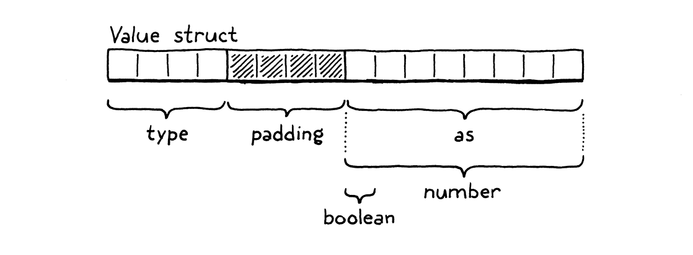

# Types of Values

Lox is dynamically typed. A single variable can hold a Boolean, number, or string at different points in time. At least,
that's the idea. Right now, in clox, all values are numbers. We will add support for Booleans and `nil`.

> There is a third category next to statically typed and dynamically typed: **unityped**. In that paradigm, all 
> variables have a single type, usually a machine register integer. Unityped languages aren't common today, but some 
> Forths and BCPL, the language that inspired C, worked like this. 
> 
> As of this moment, clox is unityped.

## Tagged Unions

The nice thing in C is that we can build our DS from the raw bits up. The bad thing is that we *have* to do that. C 
doesn't give you much for free at compile time and even less at runtime. In C's view, the universe is an 
undifferentiated array of bytes. It's up to us to decide how many of those bytes to use and what they mean.

To choose a value representation, we need to answer two key questions:
1. **How do we represent the type of value?** If you try to, say, multiply a number by `true`, we need to detect that
    error at runtime and report it. To do that, we need to be able to tell what a value's type is.
2. **How do we store the value itself?** We need to not only be able to tell that three is a number, but that it's 
    different from the number four. I know, seems obvious, right? But we're operating at a level where it's good to 
    spell these things out.

Since we're not just designing this language but building it ourselves, when answering these two questions, we also have 
to keep in mind the implementer's eternal quest: to do it *efficiently*.

Language hackers over the years have come up with a variety of clever ways to pack the above information into as few 
bits as possible. For now, we'll start with the simplest, classic solution: a **tagged union**. A value contains two 
parts: a type "tag", and a payload for the actual value. To store the value's type, we define an enum for each kind of
the VM supports.

On a 64-bit machine with a typical C compiler, the layout looks like above.

The four-byte type tag comes first, then the union. Most architectures prefer values be aligned to their size. Since the
union field contains an eight-byte double, the compiler adds four bytes of padding after the type field to keep that 
double on the nearest eight-byte boundary. That means we're effectively spending eight bytes on the type tag, which only
needs to represent a number between zero and three. We could stuff the enum in a smaller size, but all that would do is 
increase the padding.

So our Values are 16 bytes, which seems a little large. We'll improve it later. In the meantime, they're still small 
enough to store on the C stack and pass around by value. Lox's semantics allow that because the only types we support so
far are **immutable**. If we pass a copy of a Value containing the number three to some function, we don't need to worry
about the caller seeing modifications to the value. 

## Lox Values and C Values

## Dynamically Typed Numbers

## Two New Types

All our existing clox code is back in working order. Finally, it's time to add some new types. We've got a running 
numeric calculator that now does a number of pointless paranoid runtime type checks. We can represent other types 
internally, but there's no way for a user's program to ever create a Value of one of those types.

Not until now, that is. We'll start by adding compiler support for the three new literals: `true`, `false`, and `nil`. 
They're all pretty simple, so we'll do all three in a single batch.

With number literals, we had to deal with the fact that there are billions of possible numeric values. We attended to 
that by storing the literal's value in the chunk's constant table and emitting a bytecode instruction that simply loaded
that constant. We could do the same thing for the new types. We'd store, say, `true`, in the constant table, and use an
`OP_CONSTANT` to read it out.

> For bytecode VM, it spends much of its execution time reading and decoding instructions. The fewer, simpler 
> instructions you need for a given piece of behavior, the faster it goes. So classic optimization is shorter 
> instructions.
> 
> E.g., the Java bytecode instruction set has dedicated instructions for loading 0.0, 1.0, 2.0, and the integer values
> from -1 through 5. (This ends up being a vestigial optimization given that most mature JVMs now JIT-compile the 
> bytecode to machine code before execution anyway.)

