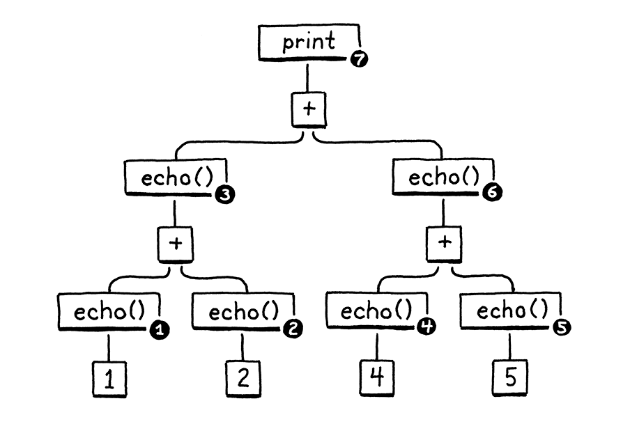
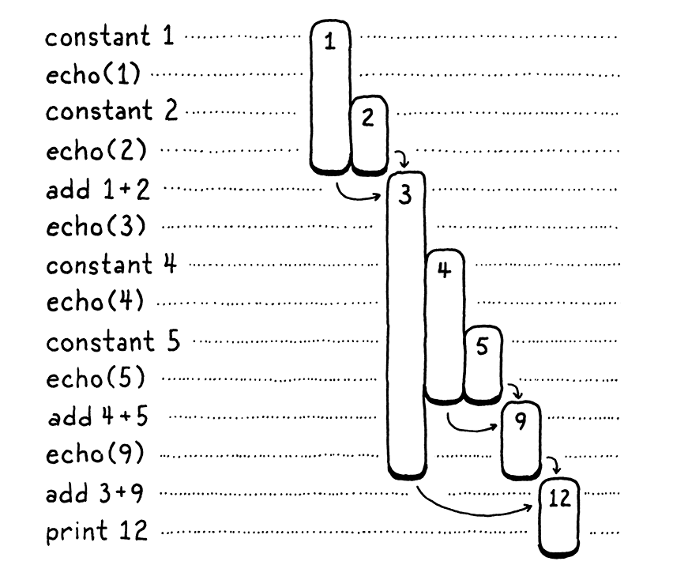
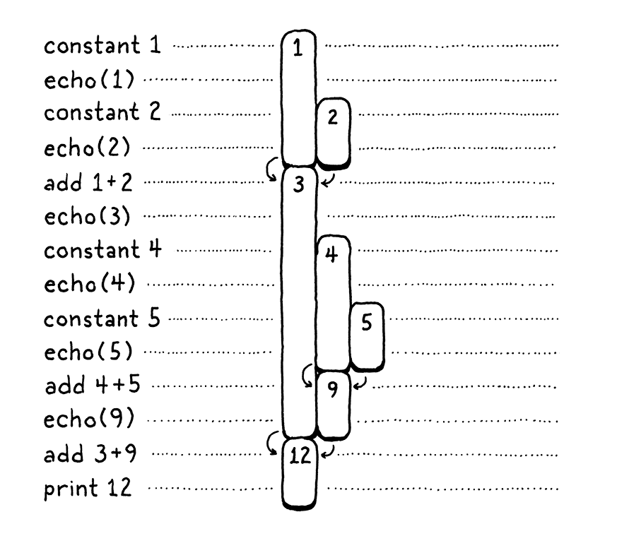

# A Virtual Machine

> Magicians protect their secrets not because the secrets are large and important, but because they are so small and 
> trivial. The wonderful effects created on stage are often the result of a secret so absurd that the magician would be
> embarrassed to admit that that was how it was done.
> - Christopher Priest, *The Prestige*

## An Instruction Execution Machine

The virtual machine is one part of our interpreter's internal architecture. You hand it a chunk of code - literally a 
Chunk - and it runs it.

> The choice to have a static VM instance is a concession for the book, but not necessarily a sound engineering choice
> for a real language implementation. If you're building a VM that's designed to be embedded in other host applications,
> it gives the host more flexibility if you *do* explicitly take a VM pointer and pass it around.
> 
> That way, the host app can control when and where memory for the VM is allocated, run multiple VMs in parallel, etc.

### *Executing instructions*

The name "IP" is traditional, and - unlike many traditional names in CS - actually makes sense: it's an [instruction 
pointer](https://en.wikipedia.org/wiki/Program_counter). Almost every instruction set in the world, real and virtual, 
has a register or variable like this.

### *Execution tracing*

If you run clox now, it executes the chunk we hand-authored in the last chpater and spits out `1.2` to terminal. We can 
see that it's working, but that's only because our implementation of `OP_CONSTANT` has temporary code to log the value.
Once that instruction is doing what it's supposed to do and plumbing that constant along to other operations that want 
to consume it, the VM will become a black box. That makes our lives as VM implementer harder.

To help ourselves out, now is a good time to add some diagnostic logging to the VM like we did with chunks themselves. 
In fact, we'll even reuse the same code. We don't want this logging enabled all the time - it's just for us VM hackers, 
not Lox users - so first we create a flag to hide it behind.

## A Value Stack Manipulator

In addition to imperative side effects, Lox has expressions that produce, modify, and consume values. Thus, our compiled
bytecode needs a way to shuttle values around between the different instructions that need them. E.g.:
````shell
print 3 - 2;
````
We obviously need instructions for the constants 3 and 2, the `print` statement, and the subtraction. But how does the 
subtraction know that 3 is the minuend and 2 is the subtrahend? How does the print instruction know to print the result
of that?

To put a finer point on it, look at this thing right here:
```shell
fun echo(n) {
  print n;
  return n;
}

print echo(echo(1) + echo(2)) + echo(echo(4) + echo(5));
```
I wrapped each subexpression in a call to `echo()` that prints and return its argument. That side effect means we can 
see the exact order of operations.

Don't worry about the VM for a minute. Think about just the semantics of Lox itself. The operands to an arithmetic 
operator obviously need to be evaluated before we can perform the operation itself. (It's pretty hard to add `a + b` if
you don't know what `a` and `b` are.) Also, when we implemented expressions in jlox, we decided that the left operand 
must be evaluated before the right.

> We could have left evaluation order unspecified and let each implementation decide. That leaves the door open for 
> optimizing compilers to reorder arithmetic expressions for efficiency, even in cases where the operands have visible
> side effects. C and Scheme leave evaluation order unspecified. Java specifies left-to-right evaluation like we do for 
> Lox.
> 
> I think nailing down stuff like this is generally better for users. When expressions are not evaluated in the order 
> users intuit - possibly in different orders across different implementations! - it can be a burning hellscape of pain
> to figure out what's going on.

Here is the syntax tree for the `print` statement:

Given left-to-right evaluation, and the way the expressions are nested, any correct Lox implementation *must* print 
these numbers in this order:
```shell
1   // from echo(1)
2   // from echo(2)
3   // from echo(1 + 2)
4   // from echo(4)
5   // from echo(5)
9   // from echo(4 + 5)
12  // from print 3 + 9
```
Our old jlox interpreter accomplishes this by recursively traversing the AST. It does a **postorder traversal**. First 
it recurses down the left operand branch, then the right operand, then finally it evaluates the node itself.

After evaluating the left operand, jlox needs to store that result somewhere temporarily while it's busy traversing down
through the right operand tree. We use a local variable in Java for that. Our recursive tree-walk interpreter creates a
unique Java call frame for each node being evaluated, so we could have as many of these local variables as we needed.

In clox, our `run()` function is not recursive - the nested expression tree is flattened out into a linear series of 
instructions. We don't have the luxury of using C local variables, so how and where should we store these temporary 
values? You can probably guess already, but I want to really drill into this because it's an aspect of programming that
we take for granted, but we rarely learn *why* computers are architected this way.

We'll walk through the execution of the above program a step a time:

On the left are the steps of code. On the right are the values we're tracking. Each bar represents a number. It starts 
when the value is first produced - either a constant or the result of an addition. The length of the bar tracks when a 
previous produced value needs to be kept around, and it ends when that value finally gets consumed by an operation.

As you step through, you see values appear and then later get eaten. The longest-lived ones are the values produced from
the left-hand side of an addition. Those stick around while we work through the right-hand operand expression.

In the above diagram, I gave each unique number its own visual column. Let's be a little more parsimonious. Once a 
number is consumed, we allow its column ot be reused for another later value. In other words, we take all those gaps up 
there and fill them in, pushing in numbers from the right:

There's some interesting stuff going on here. When we shift everything over, each number still manages to stay in a 
single column for its entire life. Also, there are no gaps left. In other words, whenever a number appears earlier than 
another, then it  will live at least as long as that second one. The first number to appear is the last to be consumed.
...Last-in, first-out..., this is the stack!

In the second diagram, each time we introduce a number, we push it onto the stack from the right. When numbers are 
consumed, they are always popped off from rightmost to left.

Since the temporary values we need to track naturally have stack-like behavior, our VM will use a stack to manage them. 
When an instruction "produce" a value, it pushes it onto the stack. When it needs to consume one or more values, it gets
them by popping them off the stack.

### *The VM's Stack*

When you first see a magic trick, it feels like something actually magical. But then you learn how it works - usually 
some mechanical gimmick or misdirection - and the sense of wonder evaporates. There are a couple of ideas in CS where 
even after I pulled them apart and learned all the ins and outs, some of the initial sparkle remained. Stack-based VMs 
are one of those.

> Heaps - the data structure, not the memory management thing - are another. 
> 
> To take a bit of the sheen off: stack-based interpreters aren't a silver bullet. They're often *adequate*, but modern
> implementations of the JVM, che CLR, and JavaScript all use sophisticated [just-in-time 
> compilation](https://en.wikipedia.org/wiki/Just-in-time_compilation) pipelines to generate *much* faster native code 
> on the fly.

### *Stack tracing*

We have a working stack, but it's hard to *see* that it's working. When we start implementing more complex instructions
and compiling and running larger pieces of code, we'll end up with a lot of values crammed into that array. It would 
make our lives as VM hackers easier if we had some visibility into the stack.