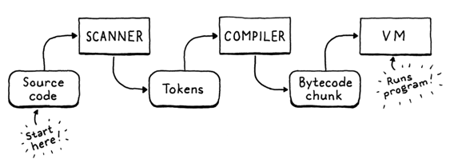
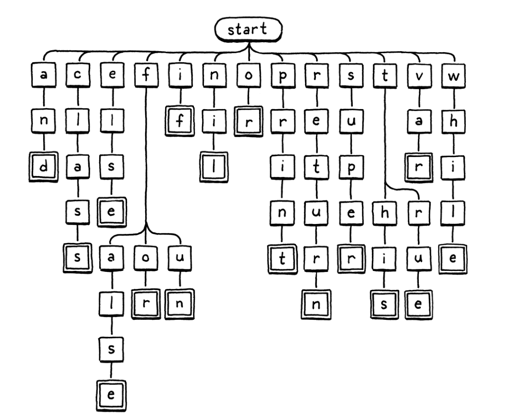
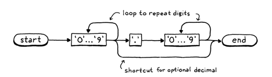

# Scan on Demand

## A Token at a Time

In jlox, when the starting gun went off, the scanner raced ahead and eagerly scanned the whole program, returning a list
of tokens. This would be a challenge in clox. We'd need some sort of growable array or list to store the tokens in. We'd 
need to manage allocating and freeing the tokens, and the collection itself. That's a lot of code, and a lot of memory
churn.

At any point in time, the compiler needs only one or two tokens - remember our grammar requires only a single token of 
lookahead - so we don't need to keep then *all* around at the same time. Instead, the simplest solution is to not scan a
token until the compiler needs one. When the scanner provides one, it returns the token by value. It doesn't need to 
dynamically allocate anything - it can just pass tokens around on the C stack.

Unfortunately, we don't have a compiler yet that can ask the scanner for tokens, so the scanner will just sit there 
doing nothing. To kick into action, we'll write some temporary code to drive it.

Aside from prefixing all the names with `TOKEN_` (since C tosses enum names in the top-level namespace) the only 
difference is that extra `TOKEN_ERROR` type. What's that about?

There are only a couple of errors that get detected during scanning: **unterminated strings** and **unrecognized 
characters**. In jlox, the scanner reports those itself. In clox, the scanner produces a synthetic "error" token for 
that error and passes it over to the compiler. This way, the compiler knows an error occurred and can kick off error
recovery before reporting it.

The novel part in clox's Token type is how it represents the lexeme. In jlox, each Token stored the lexeme as its own 
separate little Java string. If we did that for clox, we'd have to figure out how to manage the memory for those 
strings. That's especially hard since we pass tokens by value - multiple tokens could point to the same lexeme string.
Ownership gets weird.

Instead, we use the original source strings as our character store. We represent a lexeme by a pointer to its first 
character and the number of characters it contains. This means we don't need to worry about managing memory for lexemes
at all, and we can freely copy tokens around. As long as the main source code string outlives all the tokens, everything
works fine.

### *Scanning tokens*

## A Lexical Grammar for Lox

The simplest tokens are only a single character.

### *Whitespace*

Our scanner needs to handle spaces, tabs, and newlines, but those characters don't become part of any token's lexeme. We
could check for those inside the main characters switch in `scanToken()` but it gets a little tricky to ensure that the 
function still correctly finds the next token *after* the whitespace when you call it. We'd have to wrap the whole body
of the function in a loop or something.

### *Numbers*

## Identifiers and Keywords

The last batch of tokens are identifiers, both user-defined and reserved. The way we recognize keywords in clox is quite
different from how we did it in jlox, and touches on some important data structures.

Here's a visual representation of branching character-inspection logic:

We start at the root node. If there is a child node whose letter matches the first character in the lexeme, we move to 
that node. Then repeat for the next letter in the lexeme and so on. If at any point the next letter in the lexeme 
doesn't match a child node, then the identifier must not be a keyword and we stop. If we reach a double-lined box, and 
we're at the lst character of the lexeme, then we found a keyword.

### *Tries and state machines*

This tree diagram is an example of a thing called a [trie](https://en.wikipedia.org/wiki/Trie). A trie stores a set of 
strings. Most other data structures for storing strings contain the raw character arrays and then wrap them inside some 
larger construct that helps you search faster. A trie is different. Nowhere in the trie will you find a whole string.

> "Trie" is one of the most confusing names in CS. Edward Fredkin yanked it out of the middle of the word "retrieval", 
> which means it should be pronounced like "tree". But, uh, there is already a pretty important data structure 
> pronounced "tree" *which tries are a special case of*, so unless you never speak of these things out loud, no one can 
> tell which one you're talking about. Thus, people these days often pronounce it like "try" to avoid the headache.

Instead, each string the trie "contains" is represented as a *path* through the tree of character nodes, as in our 
traversal above. Nodes that match the last character in a string have a special marker - the double lined boxes in the 
illustration. That way, if you trie contains, say, "banquet" and "ban", you are able to tell that it does *not* contain 
"banque" - the "e" node won't have that marker, while the "n" and "t" nodes will.

Tries are a special case of an even more fundamental data structure: a 
[deterministic finite automata](https://en.wikipedia.org/wiki/Deterministic_finite_automaton) (**DFA**). You might also
know these by other names: **finite state machine**, or just **state machine**. State machines are rad. They end up 
useful in everything from [game programming](http://gameprogrammingpatterns.com/state.html) to implementing networking 
protocols.

In a DFA, you have a set of *states* with *transitions* between them, forming a graph. At any point in time, the machine
is "in" exactly on state. It gets to other states by following transitions. When you use a DFA for lexical analysis,
each transition is a character that gets matched from the string. Each state represents a set of allowed characters.

Our keyword tree is exactly a DFA that recognizes Lox keywords. But DFAs are more powerful than simple trees because 
they can be arbitrary *graphs*. Transitions can form cycles between states. That lets you recognize arbitrarily long 
strings. E.g., here's a DFA that recognizes number literals:

> This style of diagrams is called a [syntax diagram](https://en.wikipedia.org/wiki/Syntax_diagram) or the more charming
> **railroad diagram**. The latter name is because it looks something like a switching yard for trains.
> 
> Back before Backus-Naur Form was a thing, this was one of the predominant ways of documenting a language's grammar. 
> These days, we mostly use text, but there's something delightful about the official specification for a *textual 
> language* relying on an *image*.

You work through the path, entering nodes whenever you consume a corresponding character in the lexeme. If we were so 
inclined, we could construct one big giant DFA that does *all* the lexical analysis for Lox, a single state machine that
recognizes and spits out all the tokens we need.

However, crafting that mega-DFA by hand would be challenging. That's why 
[Lex](https://en.wikipedia.org/wiki/Lex_(software)) was created. You give it a simple textual description of your 
lexical grammar - a bunch of regular expressions - and it automatically generates a DFA for you and produces a pile of C
code that implements it.

> This is also how most regular expression engines in programming languages and text editors work under the hood. They
> take your regex string and convert it to a DFA, which they then use to match strings.
> 
> If you want to learn the algorithm to convert a regular expression into a DFA, read the dragon book.

We won't go down that road. We already have a perfectly serviceable hand-rolled scanner. We just need a tiny trie for 
recognizing keywords. How should we map that to code?

The absolute simplest solution is to use a switch statement for each node with cases for each branch. We'll start with 
the root node and handle the easy keywords.

> Simple doesn't mean dumb. The same approach is 
> [essentially what V8 does](https://github.com/v8/v8/blob/e77eebfe3b747fb315bd3baad09bec0953e53e68/src/parsing/scanner.cc#L1643),
> and that's currently one of the world's most sophisticated, fastest language implementations.

